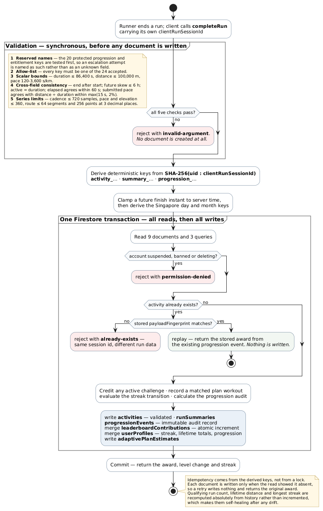
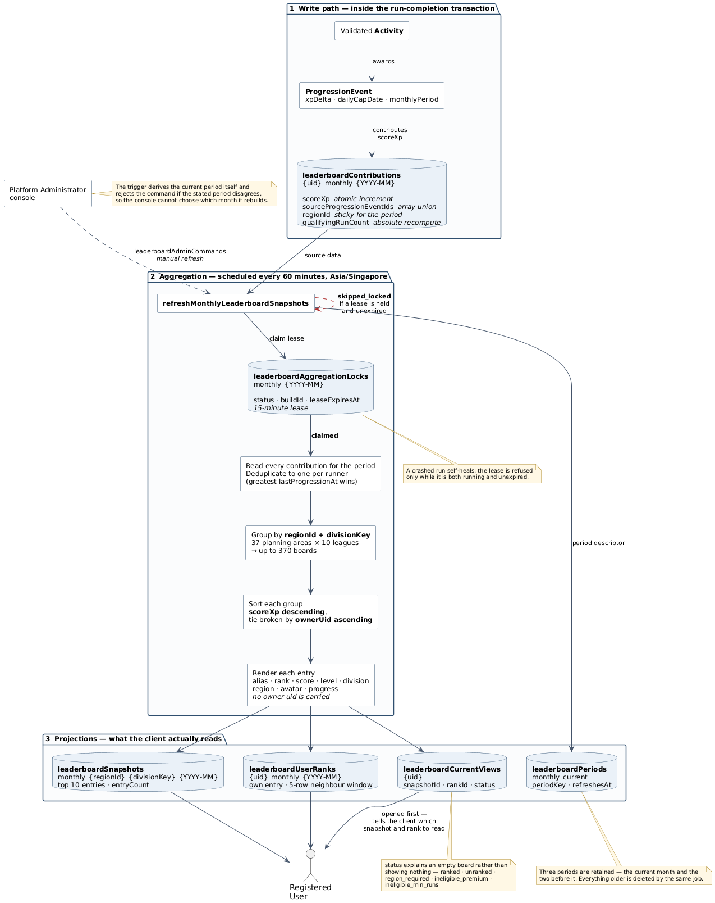

# Annex G: Detailed Firestore Schema Reference

*This annex is the full schema reference behind Chapter 3. Chapter 3 presents the entity model and the stored fields of each principal entity; this annex documents the access rules, validation limits, formula constants, indexes, key formats and storage layout that sit beneath it, together with the trade-offs the model accepts. It is written for a reader verifying a claim in Chapter 3 against the implementation, and every figure, name and limit here was read from the deployed `firestore.rules`, `firestore.indexes.json`, `storage.rules` and the TypeScript modules under `functions/src`.*

## G.1 Scope

The annex follows the order a reader is likely to need. Section G.2 restates the design principles the model is built on and Section G.3 the reasoning behind the storage engine. Section G.4 lists every collection. Section G.5 documents the trust boundary in full: the hundred backend-owned field names, the complete client-writable surface with its per-field validation, and the suspension check. Sections G.6 to G.11 take each domain in turn. Sections G.12 to G.15 cover configuration, indexes, key formats and Cloud Storage, Section G.16 records the known limitations, and Section G.17 is the complete field reference for every entity in Chapter 3.

Figure and table numbering restarts within this annex. Where the annex repeats a figure from Chapter 3 it is not reproduced; the two diagrams unique to this annex are Figures G.1 and G.2.

## G.2 Design principles

Six principles run through the whole model and are set out here before the collections are described, because almost every subsequent design decision follows from one of them.

**Server-owned progression.** Any value that determines a runner's standing relative to other runners is written only by a Cloud Function using the Admin SDK, which bypasses security rules entirely. The rules then close the corresponding client path so that no client write can reach the same field. This is enforced by an explicit list of one hundred field names, described in Section G.5.

**Deterministic document identifiers.** Where an operation must be safely repeatable (a run submission that the client may retry after a dropped connection, a cool-down bonus, a moderation command, a report), the document key is derived from the operation's inputs rather than auto-generated. A retry then targets the document the first attempt already created, and an existence check inside a transaction is sufficient to make the whole operation idempotent. Section G.14 collects these key formats.

**Denormalised read models.** Firestore charges per document read and cannot join, so the screens a runner opens most often are served by documents that already contain everything the screen needs. The leaderboard board a runner sees is a single pre-computed snapshot document holding ten fully-rendered rows, so drawing it costs one read rather than ten profile lookups. Section G.9 describes the projection pipeline that produces these.

**Snapshots at the point of trust.** Where one document displays another entity's identity, such as a feed post showing the author's name or a challenge roster showing a participant's initials, the displayed values are copied into the referring document at write time rather than read live. This bounds the read cost of a list screen, and it means the display value was validated once by the server rather than being resolvable by whoever happens to control the referenced document later.

**Audit before aggregate.** Progression is not held only as a running total. Every experience award writes an immutable event document recording the inputs, the intermediate values, the caps applied and the before-and-after state. The totals on the profile are derived from that ledger, which remains the authoritative record. Section G.8 covers this, and it is the part of the model that most directly supports the fairness claim the project makes.

**Closed by default.** The rules file terminates in a catch-all that denies every read and write to any path not explicitly matched above it. A collection that nobody remembered to write a rule for is inaccessible to clients rather than open to them.

## G.3 Choice of database technology

The earlier documents selected Firebase as the backend platform, and Cloud Firestore follows from that choice. This section restates why the choice suits this system and what it costs, because several later sections of this annex exist only because of the trade-off.

Firestore fits Runiac in three respects. Real-time listeners let the home dashboard, the friend list and the challenge progress bar update without polling. Offline persistence in the mobile SDK matters for an application whose primary activity happens outdoors on an unreliable connection. The third respect is that security rules run inside the database, so an access decision does not depend on every client request passing through application code the team wrote, which meaningfully reduces the attack surface for a project of this size and staffing.

The costs are equally concrete. There is no join, so any view that needs data from two entities either performs two reads or relies on denormalised copies, and the system uses both strategies in different places. There is no uniqueness constraint, so the uniqueness of a nickname has to be manufactured by a separate claim collection keyed on the nickname itself (Section G.6.2). Aggregate queries go no further than counting, so a leaderboard has to be materialised by a scheduled job rather than expressed as an `ORDER BY`. And every non-trivial query must be backed by a declared composite index or it will fail at run time rather than merely run slowly, which turns query planning into a design-time activity recorded in a manifest file.

Two of these, manufactured uniqueness and materialised aggregates, account for a substantial share of the collections in the inventory that follows. They exist to compensate for the storage engine rather than to model anything in the problem domain, and the inventory is easier to read once that is understood.

## G.4 Complete collection inventory

The deployed security rules declare access for **43 top-level collections** and **14 subcollection paths**, fifty-seven distinct document paths in total, beneath a catch-all rule that denies everything else. A further four collections are written only by the Admin SDK and carry no rule at all, since the catch-all denial at the foot of the rules file already makes them unreachable from any client: the governance audit log `adminAuditLogs`, the per-challenge contribution markers at `challengeInstances/{challengeId}/contributions`, and the two friend-graph rate-limit ledgers `friendCooldowns` and `friendRateLimits`.

The table groups them by the concern they serve rather than alphabetically, because the boundaries between these groups are where the significant design decisions sit.

| Concern | Collections |
| --- | --- |
| Identity and profile | `users`, `userProfiles`, `nicknameClaims`, `accountDeletionCommands` |
| Friend graph | `users/{uid}/friends`, `users/{uid}/friendRequests`, `users/{uid}/blockedUsers`, `friendCooldowns`, `friendRateLimits` |
| Activity recording | `activities`, `runSummaries` |
| Training plans | `generatedPlans`, `planProgress`, `adaptivePlanEstimates`, `expertPlans`, `planEnrollments` |
| Guidance agents | `homeGuideConsents`, `agentGuidanceDaily` |
| Progression | `progressionEvents` |
| Leaderboard | `leaderboardContributions`, `leaderboardPeriods`, `leaderboardSnapshots`, `leaderboardUserRanks`, `leaderboardCurrentViews`, `leaderboardAggregationLocks`, `leaderboardAdminCommands`, `leaderboardSeedRuns` |
| Challenges | `challengeInstances` (with `participants` and `contributions`), `challengeInvitations`, `challengeSlots`, `challengeRewardGrants`, `challengePremiumHolds`, `users/{uid}/challengeHistory`, `users/{uid}/challengeBadges` |
| Social feed | `feedPosts` (with `likes` and `comments`), `users/{uid}/hiddenFeedPosts`, `sharedRoutes` |
| Moderation and support | `reports`, `moderationCommands`, `adminNotifications`, `adminAuditLogs`, `feedback`, `errorGroups` (with `reporters`), `errorReportRateLimit` (with `events`) |
| Notifications | `notificationDevices/{uid}/tokens`, `notificationDeliveries`, `notificationInbox/{uid}/items`, `notificationPreferences` |
| Configuration | `config`, `badgeConfigs` |
| Marketing | `newsletterSubscribers`, `newsletterCampaigns` (with `deliveries`), `newsletterRateLimits`, `mail` |

*Table G.1: Collection inventory grouped by concern*

Three entries in this table describe capability that is declared but not delivered, and the report states this rather than presenting the rules as evidence of a working feature. `expertPlans` and `planEnrollments` have security rules, and `planEnrollments` is additionally named in the account-deletion inventory, but no code writes either of them and `expertPlans` appears nowhere in the Cloud Functions source at all; the application's goal-oriented plan screen reads a static list compiled into the client. `sharedRoutes` accepts a client-created draft but stores no route geometry, and no code path ever advances a route to the published state the read rule looks for, so the community route screens likewise read demonstration data compiled into the client. `badgeConfigs` has a rule denying all access and no reference anywhere else in the repository; badge ownership is recorded at `users/{uid}/challengeBadges/{tierId}` instead. Chapter 2 Section 2.6.3 and 2.6.7 record the same limitation from the requirements side, and Chapter 9 discusses what completing them would involve.

## G.5 The trust boundary

This section describes the mechanism on which the integrity of the whole progression and leaderboard subsystem rests.

### G.5.1 The backend-owned key list

The rules file defines a function, `backendOwnedKeys()`, returning a list of **one hundred field names**. Two further functions build on it: `doesNotTouchBackendOwnedKeys()` asserts that an incoming document contains none of those names, and `doesNotChangeBackendOwnedKeys()` asserts that an update modifies none of them. Eight of the ten client-writable paths call one or both. The two exceptions are the feed like and comment subcollections, whose rules instead close the document to a fixed two-key and seven-key allow-list respectively. A closed list already excludes every reserved name, so the guard would be redundant there.

The effect is that the list functions as a global reserved-word table for the database. A field named `totalXp` cannot be written by a client anywhere in the system, whatever collection it appears in, because the name itself is reserved. This is a deliberately blunt instrument: a per-collection allow-list can be forgotten when a collection is added, whereas a reserved-name list applies to whatever the new collection's rule chooses to call `doesNotTouchBackendOwnedKeys()` on. The names group as follows.

| Group | Representative names | What they protect |
| --- | --- | --- |
| Experience totals and labels | `xp`, `totalXp`, `weeklyXp`, `monthlyXp`, `totalXpLabel`, `monthlyXpLabel` | The runner's accumulated score and every rendered form of it |
| Level and division | `level`, `levelLabel`, `divisionTier`, `divisionKey`, `divisionLabel`, `levelProgressPercent`, `nextLevelXp`, `xpToNextLevel` | Standing derived from the score |
| Award breakdown | `baseCompletionXp`, `distanceXp`, `durationXp`, `planCompletionBonusXp`, `rawXpBeforeActivityCap`, `rawXpBeforeDailyCap`, `activityCapApplied`, `dailyCapApplied` | The audit trail of how an award was computed |
| Streak state | `streak`, `streakCount`, `lastStreakRunDate`, `longestStreak`, `streakBonusXp`, `streakMilestoneDays`, `highestPaidStreakMilestoneDays` | The streak and, critically, the ledger of which milestone bonuses have already been paid |
| Before-and-after state | `previousTotalXp`, `nextTotalXp`, `previousLevel`, `nextLevel`, `previousDivisionKey`, `nextDivisionKey` | The immutable record of a transition |
| Leaderboard | `rank`, `leaderboardScore`, `scoreXp`, `monthlyPeriod`, `countsTowardProgression` | Position and eligibility |
| Entitlement and governance | `subscriptionStatus`, `subscriptionPrivilegeState`, `userRole`, `adminPrivilegeState`, `expertPrivilegeState` | Who is Premium and who is an administrator |
| Validation and moderation | `validationStatus`, `validatedActivityContributionState`, `moderationStatus`, `resolutionStatus`, `publishedAt`, `approvedAt`, `reviewedByAdminId` | Server verdicts on content |
| Delivery and scheduling | `deliveryState`, `serverManagedTokenState`, `backendSchedulingStatus`, `lastScheduledAt` | Notification pipeline state |
| Identity presentation | `displayName`, `nickname`, `nicknameKey`, `nicknameCanonical`, `avatarUrl`, `avatarObjectPath`, `socialDiscoveryStatus` | Values other runners see, which must pass through server validation |
| Cool-down | `coolDownXpAwarded`, `coolDownXpAwardedAt`, `coolDownProgressionEventId` | The one-shot marker preventing a repeated bonus |

*Table G.2: The one hundred backend-owned field names, grouped by what they protect*

The streak entry deserves a note. The rules file carries an inline comment against `highestPaidStreakMilestoneDays` explaining why it is on the list: it is the record of which streak milestones a runner has already been paid for, and an owner who could reset it could re-earn every milestone bonus indefinitely. That comment illustrates the reasoning the list encodes: what needs protecting is the ledger that keeps the reward one-off.

Identity presentation appearing on the same list as experience totals is the second design decision to draw out. A nickname carries no competitive weight, but other people see it, and the uniqueness and format guarantees around it are produced by a Cloud Function that also writes the claim document. Allowing a client to write `nickname` directly would let a runner hold a claim on one string while displaying another. Placing the field on the backend-owned list closes that gap at the cost of routing a cosmetic change through a callable function.

### G.5.2 What a client may write

Against those hundred reserved names, the surface a client can write at all is small: **seven top-level collections and three subcollection paths**, each with an explicit field allow-list and, in most cases, per-field validation.

| Path | Operations | Constraint |
| --- | --- | --- |
| `userProfiles/{uid}` | create, update | Owner only; exactly twelve writable keys, each validated for type, range and format |
| `generatedPlans/{uid}` | create, update | Owner only; twenty-one keys; nested week and workout structures validated by shape, with size limits of eight weeks and seven workouts |
| `activities/{activityId}` | create, update | Owner only; twelve keys; status must be `pending`. No live client path uses this (see below) |
| `sharedRoutes/{routeId}` | create | Owner only; ten keys; visibility must be `private` or `draft` |
| `planEnrollments/{enrollmentId}` | create | Owner, Premium, and the referenced plan must be published |
| `reports/{reportId}` | create | Reporter only; six keys; not suspended; user reports use a deterministic key and cannot target self |
| `notificationPreferences/{uid}` | create, update | Owner only; nine keys |
| `feedPosts/{postId}/likes/{uid}` | create, delete | Own like only; exactly two keys; timestamp must equal request time |
| `feedPosts/{postId}/comments/{commentId}` | create, update, delete | Must be able to read the post; body 1–500 characters, non-blank at both ends; author identity must match the caller's stored profile; not suspended |
| `notificationInbox/{uid}/items/{id}` | create, update | Owner only; either a client-managed local notification or a change limited to `readAt`, `deletedAt`, `updatedAt` |

*Table G.3: The complete client-writable surface*

Every other path in the database is either read-only to its owner or denied outright. `users/{uid}`, which holds subscription status, role and account status, is readable by its owner and writable by nobody: `allow create, update, delete: if false`. The six friend-graph and challenge subcollections beneath it are read-only in the same way, with list queries additionally capped at thirty documents so that a client cannot enumerate a large social graph in one request.

The `activities` row is the one entry in this table that describes an affordance no live code uses. The rule permits an owner to create an activity in `pending` status carrying twelve whitelisted fields, but the mobile client never writes to the collection; it only reads history from it. Every activity in the database is created by the `completeRun` Cloud Function through the Admin SDK, which does not evaluate rules at all, and that function writes the document already in `validated` status. The client-create path is therefore a defence-in-depth allowance for a draft-submission flow the system does not currently exercise. The report notes it rather than presenting it as behaviour, because a reader comparing the rules to the code would otherwise find the discrepancy unexplained.

Two constraints in the table are structural rather than field-level. The feed comment rule requires that the author identity written into the comment matches the caller's own `userProfiles` document, read live inside the rule, so a comment cannot be posted under a fabricated display name even though display name is itself a snapshot. The user-report rule requires the document key to be exactly `<reporterUid>_<targetId>`, which makes a second report of the same target by the same reporter arrive as an update rather than a create, and updates are denied, so deduplication follows from the choice of key rather than from any counting.

### G.5.3 The suspension check

One further predicate appears on selected write paths. `isNotSuspended()` reads the caller's `users/{uid}` document and denies the write when `accountStatus` is `suspended`, `banned` or `deleting`. It is applied to feed comment creation and update and to report creation, and to nothing else.

The rules file is explicit that this is not the primary suspension control. When an administrator suspends an account, the same console action disables the Firebase Authentication user and revokes their refresh tokens, which is what actually stops them signing in. Firebase identity tokens live for up to an hour, so the residual risk is a cached token that is still valid after the disable. The predicate closes that window, and it is applied only to the two paths where a suspended user with a live token could still plausibly harm someone else: harassing another runner through comments, or filing retaliatory reports. Every evaluation costs an additional document read, which is why it is not applied globally, and a missing document or unrecognised status is treated as not suspended so that no existing document changes behaviour because of the check.

## G.6 Identity, the profile and the friend graph

Chapter 3 Section 3.2.1 to 3.3.3 give the stored fields of `users`, `userProfiles` and `nicknameClaims`. This section documents how those fields are defended: what the rules check on each profile write, how nickname uniqueness is manufactured from a document key, and why the friend graph is stored twice.

### G.6.1 Field-level validation on the profile

Because the profile is the largest client-writable document in the system, its rule is the most detailed. Each of the twelve writable keys carries a validator that runs on create and, separately, only when the key actually changes on update. A runner editing their weight is therefore not required to re-satisfy the validator for a field they did not touch.

The validation is stricter than a type check in several places, and the specific constraints tell you something about the domain. `ageYears` must be an integer between 13 and 100, which encodes the minimum age of the service. `weightKg` must be between 30 and 250. `dateOfBirth` must match a four-two-two date pattern. Free-text fields must be non-empty and must contain no newline, carriage return or tab, with a length ceiling of eighty characters. The control-character exclusion stops a display value being used to break the layout of a list another runner is looking at. The nested `availability` and `healthSafetyReadiness` maps are validated key by key: `availability` must contain exactly `weeklySessions`, `preferredDays`, `preferredTime` and `sessionLengthMinutes`, and no other key at all.

`locationLabel` is the most consequential validator, because it must match the pattern `^[^\n\r\t]{1,68}, Singapore$`. A location that does not end in `, Singapore` cannot be stored. This is the point at which the system's single-market scope becomes a data constraint rather than a product statement, and it is load-bearing: the leaderboard resolves a runner's region by matching this exact string against a generated table of Singapore planning areas, so a profile whose location does not match one of those strings produces no leaderboard contribution at all.

### G.6.2 Manufacturing nickname uniqueness

Firestore has no unique constraint, so nickname uniqueness is built from the one guarantee the engine does offer: a document key is unique within its collection by construction.

The `nicknameClaims` collection is keyed on a value derived from the nickname itself. The nickname is trimmed, normalised to Unicode NFC and lower-cased in a locale-independent way; a canonical form longer than thirty code points is rejected outright rather than truncated, which matters because truncation would manufacture collisions between distinct nicknames that rejection does not. That canonical form is hashed with SHA-256 and the key is `n1_` followed by the hexadecimal digest. Two runners choosing nicknames that differ only in case, in Unicode composition or in surrounding whitespace therefore compete for the same document key, and only one can hold it.

The claim document stores `ownerUid`, `nicknameCanonical`, `nicknameDisplay`, a self-referential copy of the index key, and `updatedAt`. Availability requires both that the claim does not exist and, on a re-check, that its owner and canonical form agree with the caller. The collection is denied to clients entirely (`allow read, write: if false`), so the claim can only be taken through the Cloud Function that takes it and writes the profile in the same transaction.

The interlock between the two documents is the clearest example in the system of rules and functions working together. The profile rule contains a validator, `validProfileNicknameClaimAfter()`, which uses Firestore's `getAfter()` operator to inspect the claim document *as it will exist after the current write commits*, and requires that its `ownerUid` matches the caller and its key matches the nickname key being written. A profile write that changes the nickname cannot commit unless the matching claim is held by the same caller in the same commit. The claim collection is closed to clients, so in practice this validator is unsatisfiable from the client and the nickname is changed only through the callable. The rule states the invariant regardless, so that opening the claim collection later could not silently break it.

A renamed nickname deletes the old claim and writes the new one, and a fan-out then rewrites the runner's identity snapshot in every friend, friend-request and blocked-user document that references them, located by a collection-group query on the `uid` field. Account deletion deletes the claim when its owner matches and sets `socialDiscoveryStatus` to `inactive` so the runner stops resolving in friend search.

### G.6.3 The friend graph

Friendship is stored as two mirrored documents rather than one shared edge: a friendship between A and B is `users/A/friends/B` and `users/B/friends/A`. Both must exist for the relationship to be trusted, and the feed read rule checks both directions explicitly. A friend request is likewise two mirrored documents, one marked `outgoing` on the sender and one `incoming` on the recipient, both carrying the same `senderUid` and `recipientUid` so a single document is self-describing. Requests are deleted on acceptance or decline rather than transitioned to a terminal status, so `PENDING` is the only status value the collection ever holds.

Each of these documents carries a frozen identity snapshot of the *other* party (`uid`, `nickname`, `displayName`, `avatarInitials`) plus `listSortKey` (the other party's canonical nickname) and `listSortTieBreaker` (their UID). The sort fields exist because the list must be ordered by a display value the database cannot compute, and the tie-breaker makes the ordering total and therefore stably paginable. The `uid` field is duplicated alongside the document key specifically so that the rename fan-out and the account-deletion sweep can find every mirror with a collection-group query, which cannot filter on document key across collections.

Blocking is stored one-directionally at `users/{uid}/blockedUsers/{blockedUid}` but read symmetrically: any path that checks for a block checks both directions, so a block by either party suppresses visibility for both. Blocking also deletes the friendship documents in both directions.

## G.7 Activity recording and run validation

Chapter 3 Section 3.2.4 and 3.3.5 give the stored fields of `activities` and `runSummaries`. This section documents the lifecycle those documents actually follow, the validation a submitted run must pass before either is written, and the transaction that writes them.

### G.7.1 The lifecycle is one transition, not a workflow

The security rules describe a two-state model in which a client creates an activity as `pending` and something later validates it. The implementation does not work that way, and the report describes the implementation.

Validation happens synchronously, in the `completeRun` Cloud Function, *before* any document is written. A payload that fails validation raises an error and no document is created at all. A payload that passes is written already carrying `status: validated` and `validationStatus: validated`. There is no asynchronous validation worker and no `pending` document ever exists in the production system. The lifecycle is therefore a single transition from absent to validated, and the only genuine multi-state field on an activity is the cool-down marker, which goes from absent to set exactly once.

This is a simpler and stronger arrangement than the two-phase model the rules anticipate, because it means the database never holds an activity whose trustworthiness is undetermined. Every reader in the system nonetheless requires *both* status fields to read `validated` before treating the run as real, which costs nothing and would contain the blast radius if a partially-validated document ever appeared.

### G.7.2 What the server checks before it stores a run

Because the activity document is the input to every progression calculation, the validation applied to a submission is the system's principal anti-cheat control, and it is set out in full below.

The payload is checked against two lists before anything else. A **protected-key list** of the reserved progression and entitlement names is tested first, so an attempt to submit `totalXp` or `subscriptionStatus` alongside a run is rejected with a message naming it as such rather than as an unknown field. An **allow-list of twenty-four accepted keys** is then applied, rejecting anything else. Nested structures carry their own allow-lists.

Scalar bounds follow: duration at most 86,400 seconds, distance at most 100,000 metres, and average pace between 120 and 3,600 seconds per kilometre. A pace of zero is permitted only when the distance is zero. Values must be strictly positive unless the runner has explicitly confirmed a low-data save, in which case zero is allowed but the bounds still apply.

The cross-field consistency checks are the part a fabricated payload is most likely to fail. The finish instant must be strictly after the start. It may not exceed server time by more than six hours, and for the purpose of deriving the daily and monthly period keys a future timestamp is clamped to server time, so a client cannot choose which day or month its award lands in. Active duration must equal total duration exactly. Elapsed wall time must agree with the difference between the two instants to within sixty seconds, and with the sum of active and paused time to within the same tolerance. Finally, the submitted average pace must agree with the pace implied by the submitted distance and duration, to within the greater of fifteen seconds or two per cent, so distance, duration and pace cannot be varied independently.

The optional analysis series are validated structurally as well as numerically. Cadence allows up to 720 samples with values between 40 and 240 steps per minute and strictly increasing elapsed times bounded by the run's duration. The pace series allows 360 samples with pace between 150 and 1,800 seconds per kilometre, strictly increasing elapsed time and monotonically non-decreasing cumulative distance that may not exceed the submitted distance by more than ten per cent plus fifty metres. The elevation series allows 360 samples between −500 and 9,000 metres against a strictly increasing distance under the same tolerance. The route preview allows at most 64 segments and 256 points in total, with latitude and longitude inside their valid ranges and each coordinate required to be quantised to exactly three decimal places, roughly a hundred-metre grid. That is a privacy measure as much as a size limit, since a stored route cannot resolve to a doorstep.

| Structure | Sample limit | Value bounds | Additional constraint |
| --- | --- | --- | --- |
| `cadenceAnalysisSeries` | 720 | 40–240 spm | Elapsed strictly increasing, within run duration |
| `paceAnalysisSeries` | 360 | 150–1,800 s/km | Cumulative distance monotonic, within 110% + 50 m |
| `elevationSeries` | 360 | −500–9,000 m | Distance strictly increasing, within 110% + 0.05 km |
| `routePreview` | 64 segments, 256 points | Valid latitude and longitude | Coordinates quantised to three decimal places |

*Table G.4: Limits on the optional analysis structures stored with a run summary*

### G.7.3 One transaction, and why it is idempotent

The entire run-completion path executes inside a single Firestore transaction. It performs all its reads first: nine document reads and three queries, covering the activity, the summary, the progression event, both identity documents, the plan documents, the leaderboard contribution, the runner's activity history and the same-day and same-month progression events. Only then does it write.

Idempotency comes from the deterministic keys rather than from any lock. Each of the three principal documents is written only if the read showed it absent, and the whole progression, streak, plan-progress and adaptive-estimate block is gated on the activity not having existed. A retry with the same session identifier therefore writes nothing and returns the original award, read back out of the stored progression event so the runner sees identical numbers. A retry carrying *different* run data under the same session identifier is rejected outright, detected by comparing the stored payload fingerprint, which stops a session identifier being reused as a licence to overwrite a stored run.

Two of the derived totals are recomputed absolutely from full history rather than incremented: the runner's qualifying run count for the month and their lifetime distance and longest streak. Absolute recomputation costs a query but is self-healing, since a total that has drifted for any reason corrects itself on the next run.

*Figure G.1: Activity document lifecycle: submission, validation, the transactional write set, and the resulting contribution to progression and the leaderboard*

## G.8 The progression formula and the audit ledger

Chapter 3 Section 3.2.6 gives the stored fields of a progression event. This section documents the constants those fields record, the level and league tables they resolve against, and how the cool-down bonus is bounded.

### G.8.1 The award formula as stored constants

The formula is not compiled into the calculation. It lives in a configuration document, `config/progression`, deep-merged over compiled defaults, so an administrator can adjust it without a deployment. The defaults, which are also the values currently in effect, are twenty experience points for completing a run, ten for each whole kilometre, five for each whole ten minutes of active time, and twenty for completing a scheduled plan workout. A single activity is capped at 100 and a Singapore calendar day at 200.

Streak milestones sit outside both caps by deliberate design: at three, seven, fourteen and thirty consecutive days a runner receives 30, 90, 220 and 600 points respectively. Two of those exceed the daily cap, so applying the cap to them would make them unpayable. The bonus is added after the cap is applied and is subtracted out when the day's total is summed, so it neither is limited by the day's budget nor consumes it. Only the highest milestone crossed pays, never the sum, and the `highestPaidStreakMilestoneDays` high-water mark on the profile, one of the hundred reserved names, ensures each milestone pays at most once in a runner's lifetime.

The level curve is likewise stored: ten increments of 100, 150, 220, 300, 400, 520, 660, 820, 1,000 and 1,200, applied in bands of ten levels, to a maximum of level 100. The cumulative requirement for level 100 is 53,600 experience points. The ten leagues map one-to-one onto the ten level bands, so a runner's division is a pure function of their total experience and cannot diverge from their level.

| Band | Levels | Increment per level | Cumulative XP at first level of band | League |
| --- | --- | --- | --- | --- |
| 1 | 1–10 | 100 | 0 | Iron |
| 2 | 11–20 | 150 | 1,050 | Bronze |
| 3 | 21–30 | 220 | 2,620 | Silver |
| 4 | 31–40 | 300 | 4,900 | Gold |
| 5 | 41–50 | 400 | 8,000 | Platinum |
| 6 | 51–60 | 520 | 12,120 | Emerald |
| 7 | 61–70 | 660 | 17,460 | Diamond |
| 8 | 71–80 | 820 | 24,220 | Master |
| 9 | 81–90 | 1,000 | 32,600 | Grandmaster |
| 10 | 91–100 | 1,200 | 42,800 | Challenger |

*Table G.5: Level bands and their corresponding leagues; level 100 requires 53,600 experience points*

One value in the progression configuration deserves explicit mention because it is a design commitment rather than a tuning parameter. `premiumEarnsXp` is true and the leaderboard's `excludePremium` is false, which together mean a paying subscriber earns experience on exactly the same terms as a free user and appears on the same boards. The schema supports suppressing either, and the reason code `premium_no_progression` exists for that case, but the published configuration does not use it. Premium therefore affects guidance and presentation only, and has no bearing on competitive standing.

### G.8.2 The cool-down bonus

A cool-down completed after a run pays an additional bonus, computed as twenty per cent of the run's base award rounded to the nearest five, clamped to between five and twenty points and then clamped again so the run and its cool-down together cannot exceed the per-activity cap. The base figure used is the run's award *net of any streak bonus*, so a milestone run does not inflate the cool-down reward.

The bonus is guarded twice against being paid more than once, both checks inside the same transaction: the `coolDownXpAwarded` flag on the activity, and the existence of the deterministically-keyed cool-down progression event. Either alone would be sufficient in the normal case; together they survive the case where one of the two writes was lost. A repeat call returns the original award replayed from the stored event.

## G.9 The leaderboard collections

The leaderboard is the clearest case in this system of aggregation being materialised rather than queried, and it uses eight collections to do it. The reason is straightforward: Firestore cannot rank, so a board has to be built ahead of time and stored.

### G.9.1 The pipeline

A **contribution** is written on every qualifying run, at `leaderboardContributions/{uid}_monthly_{YYYY-MM}`, with the score accumulated using an atomic increment and the source event identifiers accumulated with an array union. The document also freezes the runner's region, division, alias and level label at the time of writing, and once a contribution exists for a period its region is sticky, so a runner who moves house mid-month does not migrate their existing score to a new board.

A **scheduled aggregation** runs every hour. It reads the period's contributions, deduplicates to one per runner, groups them by region and division, sorts each group, and writes three kinds of projection.

`leaderboardSnapshots/monthly_{regionId}_{divisionKey}_{YYYY-MM}` is one board: the region and division labels, the total entry count, and the top ten entries fully rendered, giving alias, rank label, score label, level label, division label, region label, numeric score, avatar URL and level progress percentage. Nothing else needs to be read to draw the board.

`leaderboardUserRanks/{uid}_monthly_{YYYY-MM}` is one runner's position: their own rendered entry plus a five-entry window centred on them, so the "runners near you" view is also a single read.

`leaderboardCurrentViews/{uid}` is the pointer document keyed on the runner, telling the client which snapshot and which rank document to open, together with a status explaining the runner's situation when there is nothing to show: `ranked`, `unranked`, `region_required` when the profile location matches no planning area, `ineligible_premium`, or `ineligible_min_runs`.

`leaderboardPeriods/monthly_current` is a single document naming the active period, its label, its timezone and when it next refreshes.

| Collection | Document key | Purpose |
| --- | --- | --- |
| `leaderboardContributions` | `{uid}_monthly_{YYYY-MM}` | Accumulating per-runner score for a period |
| `leaderboardSnapshots` | `monthly_{regionId}_{divisionKey}_{YYYY-MM}` | One rendered board, top ten entries |
| `leaderboardUserRanks` | `{uid}_monthly_{YYYY-MM}` | One runner's rank and neighbour window |
| `leaderboardCurrentViews` | `{uid}` | Pointer and status for the runner's client |
| `leaderboardPeriods` | `monthly_current` | The active period descriptor |
| `leaderboardAggregationLocks` | `monthly_{YYYY-MM}` | The aggregation lease |
| `leaderboardAdminCommands` | console-assigned | Manual refresh request and its outcome |
| `leaderboardSeedRuns` | operator-assigned | Manifest for seeded demonstration data |

*Table G.6: The leaderboard collections and their key formats*

### G.9.2 Periods, regions and ordering

The period key is `YYYY-MM` derived on Singapore time, and the next boundary is computed as midnight Singapore on the first of the following month. Only three periods are retained (the current month and the two before it), and the aggregation deletes projections outside that window.

Regions are the 37 Singapore planning areas, held in a generated table alongside their display name, the exact `locationLabel` string that matches them, the URA planning-area name and code, and the planning-region code. Two aliases are mapped so that "Central Area" resolves to Downtown Core and "Tiong Bahru" to Bukit Merah. With ten divisions, the maximum number of boards in a period is 370. A location that matches no entry yields no contribution, which is why the `region_required` status exists.

Ordering is score descending with ties broken by ascending owner UID. The tie-break matters: without it, two runners on the same score could swap positions between hourly refreshes for no reason a user could understand. The comparison is total and deterministic, so a board remains stable while its scores do.

### G.9.3 The aggregation lease

The hourly job and the manual admin refresh can collide, so the aggregation claims a lease before it starts: a document at `leaderboardAggregationLocks/monthly_{YYYY-MM}` holding a status, a build identifier, a start instant and an expiry fifteen minutes out. The claim runs in a transaction and refuses only when an existing lease is both marked running and unexpired; a crashed run therefore self-heals after fifteen minutes rather than blocking the board indefinitely. Success and failure both write a terminal status back.

The admin command path records a design decision about trust. The console writes a command document naming the period to refresh, and the trigger that consumes it **derives the current period itself and rejects the command if the stated period disagrees**, so the period is not a parameter the console can actually choose. This is the same pattern as the clamped run timestamp: an input that would let the caller select which aggregate their action affects is re-derived server-side rather than validated.

*Figure G.2: Leaderboard aggregation data flow, from a validated run through the contribution document to the three projection collections*

## G.10 The challenge collections

The distance-challenge subsystem holds seven collections plus a contribution marker, and its schema is shaped by three invariants that Firestore cannot express and that therefore had to be built.

**A runner may hold at most one live challenge.** This is enforced by `challengeSlots/{uid}`, a reservation document keyed on the runner. Creating a lobby or accepting an invitation writes the slot; every terminal path releases it, but only when the slot still points at the challenge being terminated. A stale slot pointing at a missing or already-finished instance is cleared lazily when it is next encountered.

**A given run may be credited to a challenge exactly once.** This is enforced by `challengeInstances/{challengeId}/contributions/{activityId}`, created with a create-only write inside the run-completion transaction. Because the activity key is itself deterministic, a duplicate credit attempt targets an existing document and aborts. The marker holds only the activity identifier, the challenge, the runner, the metres credited and the instant.

**A reward may be issued exactly once.** This is enforced by `challengeRewardGrants/{challengeId}_{uid}`, also create-only. Settlement is deliberately three-phase (freeze participant outcomes and release slots, issue grants one runner at a time, then finalise the instance), so that a failure part-way through leaves the instance in the settling state and the next sweep retries the remaining work without re-issuing what already succeeded.

| Collection | Document key | Contents |
| --- | --- | --- |
| `challengeInstances` | auto-generated | Owner, tier, mode, status, immutable rules snapshot, roster, team metres, timings |
| `challengeInstances/{id}/participants` | participant UID | Role, status, credited metres, reward state, frozen name and initials |
| `challengeInstances/{id}/contributions` | activity id | Idempotency marker for one credited run |
| `challengeInvitations` | `{challengeId}__{recipientUid}` | Owner, recipient, status, expiry |
| `challengeSlots` | runner UID | The one-live-challenge reservation |
| `challengeRewardGrants` | `{challengeId}_{uid}` | Idempotency record for one issued reward |
| `challengePremiumHolds` | runner UID | Grace window after a subscription lapse |
| `users/{uid}/challengeHistory` | challenge id | Frozen personal outcome |
| `users/{uid}/challengeBadges` | tier id | Permanent tier ownership, first earned |

*Table G.7: The challenge collections and their key formats*

Two details of this schema are informative beyond the challenge feature itself.

The participant document is scoped by an explicit comment in its type definition to role, status, credited metres, eligibility and a minimal server-authored identity snapshot, and to nothing else. No route, no coordinates, no run timestamps and no activity history reach it. Joining a challenge with someone therefore exposes a distance total and no part of the training log behind it. Three further display values that a roster screen needs (level label, avatar URL and level progress) are resolved live per request rather than stored, precisely so that they cannot go stale in a document a roster member can read.

`challengePremiumHolds` is denied to every client including the runner it concerns, which is stricter than the slot document beside it. The reasoning recorded in the rules is that a subscription lapse is private information, and an owner-readable hold would still be a document another roster member could probe for by existence. The runner learns about their own grace window through a callable that returns only their own. The model therefore treats *existence* as information in its own right, alongside contents.

## G.11 Social, moderation and operational collections

### G.11.1 The feed

A feed post is keyed on the activity it was published from, so publishing is naturally idempotent and a post can never be orphaned from its run. The document freezes the author's display name, avatar initials and level label at publication time, alongside the run's measurements, the storage path of the route thumbnail with that object's generation and SHA-256 digest, and the two engagement counters.

Visibility is computed in the rules rather than stored. A post is readable when its status is `published` and the reader either is the author or has a reciprocal friendship with them, and no block exists in either direction. Both halves of the friendship are checked by existence. List queries are capped at twenty documents.

The counters are maintained by triggers that recount rather than increment: a like or comment write causes a transaction that performs an aggregation count over the subcollection and stores the result. Recounting is more expensive than incrementing and is chosen deliberately, because an increment that is lost or double-applied leaves a counter permanently wrong, whereas a recount is self-correcting.

The post lifecycle declares three statuses (`published`, `deleting`, `deleted`), but only the first two are ever persisted. Deletion sets `deleting`, then a bounded cleanup runs through likes, comments, reports and hidden markers, then the thumbnail, then the post document itself. `deleted` exists in the transition table but is never written, because by the time it would apply there is no document to write it to.

### G.11.2 Moderation

The moderation model uses a command collection rather than direct writes. A report at `reports/{reportId}` is created by the reporter. The two report kinds deduplicate by different means, and the difference is instructive. A user report is written by the client directly, so its deterministic key `{reporterUid}_{targetId}` does the work: a repeat arrives as an update, and updates are denied. A feed-post report cannot be written by a client at all, because the rule refuses any create whose target type is `feedPost`, so it goes through a callable, and its key, built from length-prefixed base64url encodings of the reporter and post identifiers, is instead checked for existence inside the function's own transaction, which returns a duplicate result without writing. The same guarantee is reached once by a rule and once by a transaction, according to which side of the trust boundary the write is on. When a post crosses the configured report threshold, an automation writes a `moderationCommands` document with a deterministic key of its own, and a trigger consumes it, performs the removal, and merges the outcome back onto the same document.

The command pattern is what keeps the console out of the data path. The administrative interface writes a request; the privileged Cloud Function performs the action; the outcome, including the removed author's UID which the report document never stored, is written back to the command. Every step is recorded in `adminAuditLogs` with actor, action, target, changed fields and before-and-after values.

The report's `resolutionStatus` (`pending`, `reviewing`, `resolved`, `dismissed`, with absent read as pending) is on the backend-owned key list, and only the last two are terminal. A scheduled sweep escalates reports that have been unresolved past the configured number of days by writing an `adminNotifications` document with a per-day deterministic key, so an escalation cannot be raised twice for the same day.

### G.11.3 Error reporting and support

`errorGroups/{fingerprint}` groups application errors by a sixteen-character digest of error type, top stack frame and screen, never by user identity. The document holds a sanitised title, a redacted stack summary of at most eight frames, occurrence and affected-user counts, a derived severity and a triage status. Affected users are counted by the existence of `errorGroups/{fingerprint}/reporters/{uid}`, a document whose body is empty because the key is the entire information content. The rate-limit ledger at `errorReportRateLimit/{uid}/events/{id}` likewise stores only a timestamp, with no error content, and is pruned opportunistically on write.

`feedback/{id}` stores a category, the message, a server-computed 120-character summary, a severity the client cannot set, a triage status and note. Both collections are closed to clients entirely, since submission goes through a callable and reading is the console's job.

### G.11.4 Notifications

Device tokens live at `notificationDevices/{uid}/tokens/{fingerprint}`, keyed on the SHA-256 digest of the token rather than the token itself, with the raw token stored as a field. Keying on the digest gives a fixed-length key and lets a collection-group query find the same physical device registered under a different account, which the registration path uses to disable stale registrations elsewhere.

Delivery attempts are recorded at `notificationDeliveries/{deliveryKey}:{tokenFingerprint}`, where the delivery key is itself composed of the runner, the notification kind, the scheduled date and the subject. A pending attempt suppresses retries for five minutes, so a stuck send does not become a notification storm. The runner-visible inbox at `notificationInbox/{uid}/items/{id}` uses composed keys of the same character: the delivery key for scheduled notifications, `{postId}:{kind}:{actorUid}` for feed engagement, and `{challengeId}:{kind}:{recipientUid}:{version}` for challenges. Engagement items are created rather than merged, deliberately: overwriting would resurrect a notification the runner had already read.

The inbox is one of the few paths where a client may update a server-written document, and the rule is correspondingly narrow. An owner may change `readAt`, `deletedAt` and `updatedAt` and nothing else, unless the document is one the client created itself and marked as client-managed.

## G.12 Configuration documents

Seven documents in the `config` collection hold operational policy that an administrator can change without a deployment. All are written only by the console through the Admin SDK, and the rules permit clients to read exactly three of them.

| Document | Read by clients | Consumed by | Governs |
| --- | --- | --- | --- |
| `config/progression` | No | Cloud Functions | Award formula, caps, streak milestones, level curve, cool-down bonus |
| `config/leaderboard` | No | Cloud Functions | Minimum qualifying runs, premium exclusion, nominal season length |
| `config/featureAccess` | Yes | Cloud Functions, client, Storage rules | Per-feature minimum tier |
| `config/automation` | No | Cloud Functions | Auto-hide threshold, stale-report escalation, scheduled-job kill switches, error-notification policy |
| `config/challengeAccess` | No | Cloud Functions | Which challenge tiers require Premium |
| `config/characterAccess` | Yes | Client | Which guide characters are Premium |
| `config/paywall` | Yes | Client, console | Paywall sheet copy and displayed pricing |

*Table G.8: Configuration documents and who may read them*

Each is loaded by deep-merging the stored document over a frozen compiled default, so a partial document overrides only what it names and a missing document is not an outage. Arrays are treated as leaf values and replace the default entirely, which is relied on for the lists of Premium-only challenge tiers and characters.

Validation failure is handled in one of two ways depending on the document. For `config/progression`, `config/leaderboard` and `config/automation` a repair pass resets only the individual fields that failed and keeps the rest of the administrator's document, so one bad number does not silently revert an unrelated policy; only if the repaired document is still invalid is it discarded wholesale. For `config/featureAccess`, `config/challengeAccess` and `config/characterAccess` there is no repair pass and any invalid document is discarded in favour of the compiled defaults. In both cases the fallback is itself reported as an error group, so a bad configuration edit becomes visible in the console rather than passing silently.

One value in the leaderboard configuration is loaded but not wired: `seasonLengthDays` is read and validated, but the period model is a calendar month rather than a rolling window and retention is a hardcoded three-month span, so the field has no effect. It is recorded in the drift register.

The three client-readable documents are readable for a specific reason each, and the distinction matters. `config/paywall` and `config/characterAccess` are display concerns (sheet copy, pricing text, which characters show a lock) with no server value behind them. `config/featureAccess` is different: it is read by the client so that a tier change made in the console reaches the application's interface, but the access decision it describes is enforced independently on the server, and for one feature in the Storage rules as well. The client reads it in order to render the interface, and the decision itself is taken elsewhere. Chapter 2 Section 2.4 records the published tiers and where they differ from the compiled defaults.

## G.13 Indexes and query patterns

Firestore requires a declared composite index for any query filtering or ordering on more than one field. The manifest declares **fifteen composite indexes and four single-field collection-group overrides**, and because a query without its index fails outright, this file is effectively a list of every non-trivial query the system performs.

| Collection group | Fields | Query it serves |
| --- | --- | --- |
| `users` | `subscriptionStatus`, `subscriptionExpiresAt` | The nightly premium-expiry sweep |
| `activities` | `ownerUid`, `endedAt` (both directions) | Activity history, forward and reverse |
| `runSummaries` | `ownerUid`, `endedAt` (both directions) | Summary history, forward and reverse |
| `feedPosts` | `authorUid`, `status`, `createdAt` desc | An author's published posts, newest first |
| `feedback` | `uid`, `receivedAt` | The per-runner feedback rate limit |
| `newsletterSubscribers` | `status`, `createdAt` | The unconfirmed-subscriber sweep |
| `reports` | `targetType`, `targetId` | Counting reports against one target for auto-hide |
| `challengeInvitations` | `recipientUid`, `status`, `createdAt` desc | A runner's pending invitations |
| `challengeInstances` | `status`, `scheduledEndsAt` | The settlement sweep |
| `challengeInstances` | `rosterUids` array-contains, `createdAt` desc | The challenges a runner belongs to |
| `friendRequests` | `status`, `direction`, `listSortKey`, `listSortTieBreaker` | Incoming and outgoing request lists, ordered by display name |
| `friends` | `listSortKey`, `listSortTieBreaker` | The friend list, ordered by display name |
| `blockedUsers` | `listSortKey`, `listSortTieBreaker` | The blocked list, ordered by display name |

*Table G.9: The fifteen composite indexes and the queries they serve*

The four collection-group overrides expose `uid` on `friends`, `friendRequests` and `blockedUsers`, and `tokenFingerprint` on `tokens`. These are what make the cross-user sweeps possible: the nickname rename fan-out and the account-deletion cleanup both need to find every mirror document referring to one runner regardless of whose subtree it sits in, and a collection-group query cannot filter on document key, which is why those documents duplicate the UID as a field.

Three patterns are visible in this table. The paired ascending and descending indexes on `activities` and `runSummaries` exist because history is read newest-first in the interface but oldest-first by the streak and lifetime-total recalculations. The three sort-key indexes are the cost of ordering a list by a display value the database cannot compute, which is what the denormalised `listSortKey` and `listSortTieBreaker` fields on the friend-graph documents exist to supply. And several queries that might be expected here are absent because they were deliberately designed out: the daily experience cap sums the day's progression events by an equality filter on two fields that are already covered, and the challenge lobby-expiry sweep filters its expiry instant in application code rather than adding a second composite index for a low-volume scan.

## G.14 Deterministic document keys

Derived rather than generated document keys are used throughout the system. The table below collects the twelve where the key is enforcing a correctness invariant, because in each case the choice of key is doing work that a constraint would do in a relational database. Several further keys listed elsewhere in this annex and in Chapter 3 are derived for addressability rather than for uniqueness: the leaderboard snapshot, rank and lock keys of Table G.6, the challenge invitation key of Table G.7, the composed notification and inbox keys of Section G.11.4, and the per-post and per-day keys used by the moderation automation. These follow the same construction without carrying the same obligation.

| Document | Key format | What the key guarantees |
| --- | --- | --- |
| `activities` | `activity_` + 24 hex of SHA-256(uid:sessionId) | One activity per client run session |
| `runSummaries` | `summary_` + same digest | Summary pairs with its activity |
| `progressionEvents` (run) | `progression_` + same digest | One award per run |
| `progressionEvents` (cool-down) | `progression_cooldown_` + same digest | One cool-down bonus per run |
| `nicknameClaims` | `n1_` + SHA-256 of the canonical nickname | Nickname uniqueness |
| `feedPosts` | the activity id | One post per run |
| `reports` (feed) | length-prefixed base64url of reporter and post | One report per reporter per post |
| `reports` (user) | `{reporterUid}_{targetId}` | One report per reporter per target |
| `leaderboardContributions` | `{uid}_monthly_{YYYY-MM}` | One accumulator per runner per period |
| `challengeInstances/{id}/contributions` | the activity id | One credit per run per challenge |
| `challengeRewardGrants` | `{challengeId}_{uid}` | One reward per runner per challenge |
| `accountDeletionCommands` | the runner's UID | One deletion in flight per runner |

*Table G.10: Deterministic document keys and the invariant each enforces*

The uniform technique is that an operation which must happen at most once is expressed as the creation of a document whose key the operation determines. A create-only write then fails if the operation has already happened, and inside a transaction that failure is a reliable mutual exclusion. Firestore has no unique index, but it does guarantee that a key identifies at most one document, and every entry in this table relies on that guarantee.

## G.15 Cloud Storage layout

Binary assets are held in Cloud Storage under six prefixes, with rules that mirror the Firestore access model.

| Prefix | Written by | Read by | Constraints |
| --- | --- | --- | --- |
| `feed-thumbnail-staging/{uid}/{activityId}/{upload}` | Owner | Owner | PNG only, at most 1 MB, three required metadata keys that must match the path |
| `feed-thumbnails/{uid}/{activityId}/route-preview.png` | Cloud Function only | Owner | Promoted from staging after validation |
| `avatar-staging/{uid}/{upload}` | Owner | Owner | PNG only, at most 1 MB, owner metadata must match the path |
| `avatars/{fileName}` | Cloud Function only | Download token only | Server-minted opaque name; the file name never contains a UID |
| `share-cards/{uid}/{fileName}` | Owner, subject to entitlement | Owner and anyone holding the link | PNG only, at most 4 MB |
| `project-documents/{docId}/{fileName}` | Website Admin SDK only | Website Admin SDK only | Denied to every client |

*Table G.11: Cloud Storage prefixes and their access rules*

The staging-then-promote pattern used for both thumbnails and avatars is the storage analogue of the command pattern used for moderation. A client uploads to a location where it can write, a Cloud Function validates the object and copies it to a location where the client cannot write, and only the promoted object's path is recorded on a document other people can read, so the staged object never becomes the one others see.

Two properties of this layout are consequences the report states plainly rather than glossing. Avatar objects are served by a URL containing a Firebase download token, and the rules deny direct reads, so the token is the *only* gate on the object. Anyone holding the URL can fetch the image with no authentication. The same is true of share cards, where it is the intended behaviour, since the feature exists to produce a shareable link. For avatars it is a trade-off accepted to keep image loading cheap, and the opaque server-minted file name at least ensures the object cannot be found by guessing a UID.

The share-card rule contains the system's one visible inconsistency in entitlement checking. It reads the feature tier live from `config/featureAccess` and, when the feature is gated, accepts a subscription status of either `premium` or `Premium`. The Firestore rules' `isPremiumUser()` accepts only the lower-case form. The two are equivalent for every value the system currently writes, but they would diverge if a legacy capitalised value were ever stored, and the divergence is recorded in the drift register rather than left for a reader to discover.

## G.16 Design trade-offs and known limitations

Several characteristics of this model are trade-offs rather than defects, and they are stated here rather than defended.

**Denormalisation makes display values stale.** A feed post carries the author's name as it was at publication; a friend document carries a nickname snapshot; a challenge roster carries frozen initials. Each is a deliberate choice to bound read cost, and each requires a fan-out to repair when the source changes. The nickname rename fan-out exists for exactly this reason and is bounded by a collection-group query, and the challenge roster resolves its most volatile fields (level, avatar, progress) live per request instead of storing them. Where a snapshot is not repaired, as with the author name on an old feed post, the report treats that as acceptable: a post is a record of a moment, and showing the name in force at that moment is defensible.

**Absolute recomputation costs reads but self-heals.** Lifetime distance, longest streak and monthly qualifying run count are recomputed from full history on every run rather than incremented. For a runner with a long history this is the most expensive part of the completion transaction. It was chosen because an incremented total that drifts stays wrong forever, whereas a recomputed one corrects itself, and because the daily cap must be derived from the event ledger anyway.

**Timestamps are inconsistent in type.** Activities, summaries, plan progress and adaptive estimates store client-supplied ISO strings for `createdAt` and `updatedAt`; consent, guidance and most operational documents store real server timestamps. The system compensates by clamping any future client timestamp to server time before deriving period keys, so the inconsistency cannot be exploited for period selection, and readers parse defensively across timestamp, number and string forms. It nonetheless means a document's stored creation time is not always a server observation, and a future revision should normalise this.

**Not every declared collection is live.** `expertPlans`, `planEnrollments`, `sharedRoutes` and `badgeConfigs` carry rules for capability the implementation does not deliver, as Section G.4 records. Leaving the rules in place is harmless, since they deny more than they permit, but the report does not present them as evidence of a feature.

**One index is not declared and one collection is not swept.** The challenge settlement sweep filters lobby expiry in application code rather than declaring a second composite index, which is a cost decision that would need revisiting at higher volumes. `leaderboardCurrentViews` has no period-based cleanup because it is keyed on the runner and only ever overwritten, which is why the aggregation re-plans every existing view document on every run rather than only those with contributions.

## G.17 Complete field reference

Chapter 3 Section 3.2 describes each entity and the design decision it carries. This section gives the complete stored field list for each one, with type, ownership and meaning.

The **Own.** column records who owns each field: **B** for backend-owned, meaning the server writes it and the security rules refuse any client write to a field of that name anywhere in the database; **O** for owner-writable, meaning the runner may write it directly; and **S** for a snapshot, meaning a value copied from another entity at write time and not read live. Section G.5.1 gives the full reserved-name list the **B** marking draws on.

### G.17.1 User

`users/{uid}`, keyed on the Firebase Authentication UID. Holds entitlement and governance only. Readable by its owner; writable by no client.

| Field | Type | Own. | Meaning |
| --- | --- | :-: | --- |
| `subscriptionStatus` | string | B | `basic` or `premium`; the materialised entitlement tier |
| `subscriptionExpiresAt` | timestamp or null | B | When Premium lapses; null means no expiry |
| `subscriptionUpdatedAt` | timestamp | B | When the tier last changed |
| `subscriptionSource` | string | B | Provenance of the last change, e.g. `system-expiry` |
| `userRole` | string | B | `platformAdmin` for an operator; otherwise an ordinary runner |
| `accountStatus` | string | B | `suspended`, `banned`, `deleting`, or absent for a normal account |
| `accountDeletionRequestedAt` | timestamp | B | Set when the runner requests deletion |

*Table G.12: The `User` entity*

### G.17.2 UserProfile

`userProfiles/{uid}`, keyed on the UID, which is also the foreign key to `User`. Holds the runner's own data, their identity presentation, and the materialised progression totals. The runner may write twelve of these fields; the rest are backend-owned.

| Field | Type | Own. | Meaning |
| --- | --- | --- | --- |
| `fullName` | string | O | Display name entered at onboarding |
| `dateOfBirth` | string `YYYY-MM-DD` | O | |
| `ageYears` | integer 13–100 | O | Lower bound encodes the minimum age of the service |
| `weightKg` | number 30–250 | O | Used for calorie estimation on the device |
| `locationLabel` | string ending `, Singapore` | O | Resolves to a planning area for the leaderboard |
| `fitnessLevel` | string | O | Self-declared level from onboarding |
| `goals` | list | O | Selected running goals |
| `availability` | map | O | `weeklySessions`, `preferredDays`, `preferredTime`, `sessionLengthMinutes` |
| `planCautiousness` | string | O | How conservative the generated plan should be |
| `healthSafetyReadiness` | map | O | Seven onboarding health and readiness answers |
| `publicStatsHidden` | boolean | O | The runner's "keep my record private" preference |
| `updatedAt` | timestamp | O | |
| `nickname` | string | B | The runner's chosen nickname |
| `nicknameCanonical` | string | B | Trimmed, NFC-normalised, lower-cased form |
| `nicknameIndexKey` | string | B | Points at the matching `NicknameClaim` |
| `displayName` | string | B | Set equal to the nickname |
| `avatarInitials` | string, ≤3 characters | B | Derived from the display name |
| `socialDiscoveryStatus` | string | B | `active` or `inactive`; controls friend-search visibility |
| `socialListSortKey` | string | B | Canonical nickname, used for ordering |
| `avatarUrl` | string | B | Served URL of the current avatar |
| `avatarObjectPath` | string | B | Storage path of the current avatar |
| `avatarPreviousObjectPath` | string | B | Prior generation, kept for one cycle |
| `avatarUpdatedAt` | timestamp | B | Also the key for the replace cool-down |
| `totalXp` | integer | B | Lifetime experience |
| `level` | integer 1–100 | B | Derived from `totalXp` |
| `levelLabel`, `totalXpLabel` | strings | B | Rendered display forms |
| `divisionTier` | integer 1–10 | B | League tier |
| `divisionKey` | string `tier_01`–`tier_10` | B | League key |
| `divisionLabel` | string | B | e.g. `Gold League` |
| `nextLevelXp` | integer or null | B | Threshold of the next level; null at maximum |
| `xpToNextLevel` | integer or null | B | Remaining experience; null at maximum |
| `levelProgressPercent` | integer 0–100 | B | Progress within the current level |
| `monthlyXp`, `monthlyXpLabel` | integer, string | B | Experience in the current Singapore month |
| `highestPaidStreakMilestoneDays` | integer | B | Largest streak milestone ever paid; never regresses |
| `progressionUpdatedAt` | string | B | Last progression write |
| `streakCount` | integer | B | Current consecutive-day streak |
| `lastStreakRunDate` | string `YYYY-MM-DD` | B | Last day counted toward the streak |
| `streakUpdatedAt` | string | B | |
| `longestStreak`, `longestStreakLabel` | integer, string | B | Lifetime maximum; never regresses |
| `totalDistanceMeters`, `totalDistanceLabel` | number, string | B | Lifetime distance over validated runs |
| `subscriptionStatus` | string | B | Mirror of the `User` value, kept to save a read |

*Table G.13: The `UserProfile` entity*

### G.17.3 NicknameClaim

`nicknameClaims/{nicknameIndexKey}`: the primary key is `n1_` followed by the SHA-256 digest of the canonical nickname. This entity exists solely to manufacture uniqueness, which Firestore does not provide: two runners choosing nicknames that differ only in case, whitespace or Unicode composition compete for the same key and only one can hold it. Denied to clients entirely.

| Field | Type | Own. | Meaning |
| --- | --- | --- | --- |
| `ownerUid` | string, FK to `User` | B | Who holds the claim |
| `nicknameCanonical` | string | B | The canonical form the key was derived from |
| `nicknameDisplay` | string | B | The display-cased nickname |
| `nicknameIndexKey` | string | B | Self-referential copy of the key |
| `updatedAt` | timestamp | B | |

*Table G.14: The `NicknameClaim` entity*

### G.17.4 Activity

`activities/{activityId}`: the primary key is `activity_` followed by the first 24 hexadecimal characters of `SHA-256(uid : clientRunSessionId)`. The canonical record of a completed run: ownership, the validation verdict, the measurements, and the flags deciding what the run counts toward.

| Field | Type | Own. | Meaning |
| --- | --- | --- | --- |
| `ownerUid` | string, FK to `User` | B | The runner |
| `status` | string `validated` | B | Coarse lifecycle status |
| `validationStatus` | string `validated` | B | Fine-grained verdict; readers require both |
| `source` | string `mobile` | B | The only accepted origin |
| `activityType` | string `run` | B | |
| `startedAt`, `endedAt` | ISO timestamp strings | B | The finish instant is stored as `endedAt` |
| `durationSeconds` | number | B | Total recorded duration |
| `activeDurationSeconds` | number | B | Moving time |
| `elapsedWallSeconds` | number | B | Wall-clock span |
| `pausedDurationSeconds` | number | B | Paused time |
| `distanceMeters` | number | B | |
| `averagePaceSecondsPerKm` | number | B | Cross-checked against distance and duration |
| `routePrivacy` | string | B | `private` or `public` |
| `clientRunSessionId` | string | B | The client's idempotency token |
| `payloadFingerprint` | SHA-256 hex | B | Digest of the submitted payload; detects a replay with altered data |
| `createdAt`, `updatedAt`, `processedAt` | ISO strings | B | All equal the submitted finish instant |
| `validatedActivityContributionState` | string | B | `awarded` or `not_awarded` |
| `countsTowardProgression` | boolean | B | Whether experience was granted |
| `countsTowardStreak` | boolean | B | |
| `plannedWorkoutRecorded` | boolean | B | Whether a scheduled plan workout was marked complete |
| `validationReason` | string | B | Reason code carried onto the progression event |
| `cadenceAnalysisSeries` | map, optional | B | Cadence samples, when the device produced them |
| `coolDownXpAwarded` | boolean | B | One-shot marker set by the cool-down path |
| `coolDownXpAwardedAt` | ISO string | B | |
| `coolDownProgressionEventId` | string, FK | B | The cool-down event this activity produced |

*Table G.15: The `Activity` entity*

The security rules also permit a runner to create an activity in a `pending` state as a defence-in-depth allowance, but no client path uses it: every activity in the database is written by the run-completion Cloud Function, already validated. Annex G Section G.5 records this.

### G.17.5 RunSummary

`runSummaries/{summaryId}`: the primary key is `summary_` followed by the same digest as its activity. The presentation record: the same measurements plus pre-formatted display strings and the optional analysis series that drive the post-run charts. The split from `Activity` keeps several hundred samples out of the document that history queries and streak recalculations read.

| Field | Type | Own. | Meaning |
| --- | --- | --- | --- |
| `ownerUid` | string, FK to `User` | B | |
| `activityId` | string, FK to `Activity` | B | Back-pointer |
| `clientRunSessionId` | string | B | |
| `title` | string | B | Defaults to `Completed Run` |
| `startedAt`, `endedAt` | ISO strings | B | |
| `distanceMeters`, `durationSeconds`, `activeDurationSeconds`, `elapsedWallSeconds`, `pausedDurationSeconds` | numbers | B | As on the activity |
| `averagePaceSecondsPerKm` | number | B | |
| `displayDistance` | string | B | e.g. `5.20 km` |
| `displayDuration` | string | B | e.g. `32:14` |
| `displayPace` | string | B | e.g. `372 sec/km` |
| `routeLabel` | string, optional | B | |
| `cadenceAnalysisSeries` | map, optional | B | Up to 720 samples, 40–240 steps per minute |
| `paceAnalysisSeries` | map, optional | B | Up to 360 samples with cumulative distance |
| `elevationSeries` | map, optional | B | Up to 360 samples, −500 to 9,000 metres |
| `routePreview` | map, optional | B | Up to 64 segments and 256 points, quantised to three decimal places |
| `createdAt` | ISO string | B | |

*Table G.16: The `RunSummary` entity*

The three-decimal quantisation on the route preview is a privacy measure as much as a size limit: it reduces a stored route to roughly a hundred-metre grid, so a saved route cannot resolve to a doorstep.

### G.17.6 ProgressionEvent

`progressionEvents/{eventId}`: the primary key is `progression_` or `progression_cooldown_` followed by the activity's digest. This is the entity that makes the project's fairness claim verifiable, an immutable record of every experience award that stores the whole calculation alongside the amount. Readable by its owner; writable by no client. Nothing ever updates or deletes an event.

| Field | Type | Own. | Meaning |
| --- | --- | --- | --- |
| `ownerUid` | string, FK to `User` | B | |
| `activityId` | string, FK to `Activity` | B | |
| `eventType` | string | B | `run_completion_xp` or `cool_down_stretch_bonus` |
| `status` | string | B | `awarded`, `not_awarded` or `deferred` |
| `createdAt` | ISO string | B | |
| `xpDelta` | integer | B | The award actually granted |
| `baseCompletionXp` | integer | B | 20 for completing a run |
| `distanceXp` | integer | B | 10 per whole kilometre |
| `durationXp` | integer | B | 5 per whole ten active minutes |
| `planCompletionBonusXp` | integer | B | 20 when a scheduled workout was completed |
| `rawXpBeforeActivityCap` | integer | B | Total before the 100-per-activity cap |
| `activityCapApplied` | boolean | B | Whether that cap bound |
| `rawXpBeforeDailyCap` | integer | B | Total before the 200-per-day cap |
| `dailyCapApplied` | boolean | B | Whether that cap bound |
| `dailyCapDate` | string `YYYY-MM-DD` | B | Singapore day the award was attributed to |
| `monthlyPeriod` | string `YYYY-MM` | B | Singapore month |
| `dailyXpBefore`, `dailyXpAfter` | integers | B | The day's running total either side of this award |
| `monthlyXpBefore`, `monthlyXpAfter` | integers | B | The month's running total |
| `streakBonusXp` | integer | B | Milestone bonus, exempt from both caps |
| `streakMilestoneDays` | integer or null | B | Which milestone paid: 3, 7, 14 or 30 |
| `previousStreak`, `nextStreak` | integers | B | |
| `previousStreakRunDate`, `nextStreakRunDate` | date strings | B | |
| `previousTotalXp`, `nextTotalXp` | integers | B | |
| `previousLevel`, `nextLevel` | integers | B | |
| `previousDivisionKey`, `nextDivisionKey` | strings | B | |
| `previousLevelProgressPercent`, `nextLevelProgressPercent` | integers | B | |
| `nextLevelXpTarget`, `nextXpToNextLevel` | integers or null | B | |
| `plannedWorkoutBonusApplied`, `plannedWorkoutMatched`, `plannedWorkoutRecorded` | booleans | B | Plan linkage |
| `plannedWorkoutId`, `plannedWorkoutMatchedBy`, `planEnrollmentId` | strings or null | B | |
| `countsTowardLeaderboard` | boolean | B | |
| `reason` | string | B | One of seven codes, so a zero award is distinguishable from no award |
| `baseEarnedXp`, `completedStretchCount` | integers | B | Cool-down events only |

*Table G.17: The `ProgressionEvent` entity*

Because this ledger exists, the totals on `UserProfile` are derived data rather than the record. The day's cap is enforced by summing the day's events rather than by trusting a counter, and a dispute about a runner's score is answered by reading the events.

### G.17.7 GeneratedPlan

`generatedPlans/{uid}`, keyed on the UID. The runner's current training plan, produced from their onboarding answers. This is the largest client-writable document in the system: the runner owns twenty-one fields, and the security rules validate the nested week and workout structures by shape.

| Field | Type | Own. | Meaning |
| --- | --- | --- | --- |
| `planId` | string | O | Identifier referenced by `PlanProgress` |
| `planKind` | string `onboardingBased` | O | |
| `title`, `subtitle`, `sourceLabel` | strings | O | Display header |
| `startsOnDate` | string `YYYY-MM-DD` | O | Anchors the weekly schedule |
| `durationWeeks` | integer | O | |
| `safetyBand`, `safetyNote` | string | O | Derived from the health readiness answers |
| `templateKind` | string | O | |
| `family`, `familyCategory`, `familyReason` | strings | O | Which plan family was selected and why |
| `supportStyleLabel`, `weeklyFrequencyLabel`, `preferredScheduleLabel`, `sessionDurationLabel` | strings | O | Echoes of the onboarding answers |
| `clientDisplayStatus` | string | O | `generatedPlan` or `safetyReadiness` |
| `weeks` | list, at most 8 | O | Each with `weekNumber`, `title`, `focus`, `workouts` |
| `weeks[].workouts` | list, at most 7 | O | Each with `dayLabel`, `title`, `durationMinutes`, `kind`, `intensity`, `description`, `steps`, `supportiveNote`, `scheduleTimeLabel`, `detail` |
| `weeks[].workouts[].detail` | map | O | `metrics`, `breakdown`, `effortGuide`, `coachNotes` |
| `createdAt`, `updatedAt` | timestamps | O | |

*Table G.18: The `GeneratedPlan` entity*

A rest day is expressed by omitting the day from `workouts` rather than by storing a rest entry, which is why the streak calculation reads the plan rather than assuming seven entries per week.

### G.17.8 PlanProgress

`planProgress/{uid}`, keyed on the UID. Records which scheduled workouts a runner has completed. Written only by the server, at the moment a run is matched to a workout and found to have met its objective.

| Field | Type | Own. | Meaning |
| --- | --- | --- | --- |
| `ownerUid` | string, FK to `User` | B | |
| `latestSourceGeneratedPlanId` | string, FK to `GeneratedPlan` | B | The plan the most recent completion came from |
| `planSnapshots` | map keyed by `planId` | B | Frozen copy of the plan at completion time, so later runs are matched against what was scheduled rather than what the plan says now |
| `workouts` | map keyed by `planId__workoutId` | B | One entry per completed workout |
| `workouts[].status` | string `completed` | B | |
| `workouts[].activityId`, `clientRunSessionId` | strings, FK | B | The run that completed it |
| `workouts[].completedAt`, `scheduledDate` | strings | B | |
| `workouts[].title`, `scheduledWorkoutId` | strings | B | |
| `workouts[].matchedBy` | string | B | `explicit` or `date` |
| `workouts[].actualDurationSeconds`, `actualDistanceMeters` | numbers | B | What the run achieved |
| `workouts[].objectiveKind`, `objectiveSeconds`, `objectiveMeters` | string, numbers | B | What the workout required |
| `planCompletions` | map keyed by `planId` | B | Written once when a plan is finished |
| `completedWorkoutCount` | integer | B | Lifetime count across all plans |
| `updatedAt` | ISO string | B | |

*Table G.19: The `PlanProgress` entity*

The `planSnapshots` field is the reason this entity is larger than it looks. A runner may edit their plan after completing part of it; freezing the plan at the moment of each completion means an earlier completion cannot be invalidated by a later edit.

### G.17.9 LeaderboardContribution

`leaderboardContributions/{uid}_monthly_{YYYY-MM}`: the primary key composes the runner and the period, so a runner has exactly one accumulator per month. The score is accumulated with an atomic increment and the source events with an array union, so a concurrent run cannot lose an award.

| Field | Type | Own. | Meaning |
| --- | --- | --- | --- |
| `schemaVersion` | integer | B | Currently 2; the planner rejects any other |
| `ownerUid` | string, FK to `User` | B | |
| `scoreXp` | integer | B | The accumulating score |
| `sourceProgressionEventIds` | list, FK to `ProgressionEvent` | B | Which awards contributed |
| `qualifyingRunCount` | integer | B | Recomputed absolutely, never incremented |
| `publicAlias` | string | S | Nickname at write time |
| `levelLabel` | string | S | Level label at write time |
| `divisionKey`, `divisionLabel` | strings | B | League at write time |
| `regionId`, `regionLabel` | strings | B | Planning area; sticky once set for a period |
| `planningAreaName`, `planningAreaCode`, `planningRegionCode` | strings | B | URA identifiers for the area |
| `periodType`, `periodKey`, `timezone` | strings | B | `monthly`, `YYYY-MM`, `Asia/Singapore` |
| `eligible` | boolean | B | |
| `eligibilityReason` | string | B | |
| `lastProgressionAt` | ISO string | B | Tie-break when several contributions exist |

*Table G.20: The `LeaderboardContribution` entity*

Region stickiness is a deliberate rule rather than an accident: a runner who changes their profile location mid-month keeps their existing score on the board they earned it on, and the new area takes effect from the next period.

### G.17.10 LeaderboardSnapshot, LeaderboardUserRank and LeaderboardCurrentView

These three entities are the materialised output of the hourly aggregation. They exist because Firestore cannot rank, and their shape is dictated by the requirement that opening the leaderboard should cost one document read.

`leaderboardSnapshots/monthly_{regionId}_{divisionKey}_{YYYY-MM}` is **one board**. With 37 Singapore planning areas and ten divisions, a period holds up to 370 of them.

| Field | Type | Own. | Meaning |
| --- | --- | --- | --- |
| `regionId`, `regionLabel` | strings | B | Which planning area |
| `divisionKey`, `divisionLabel` | strings | B | Which league |
| `periodType`, `periodKey`, `periodLabel`, `timezone` | strings | B | Which month |
| `entryCount` | integer | B | Total ranked runners in this board |
| `topEntries` | list of 10 | B | Fully rendered rows (see below) |
| `buildId`, `generatedAt`, `refreshesAt`, `updatedAt` | strings | B | Aggregation provenance |
| `aggregationStatus` | string `ready` | B | |

*Table G.21: The `LeaderboardSnapshot` entity*

A rendered entry carries `publicAlias`, `rankLabel`, `scoreLabel`, `levelLabel`, `divisionLabel`, `regionLabel`, `score`, `avatarUrl` and `levelProgressPercent`, and nothing else. In particular it carries no owner UID, so a board discloses no identity beyond the alias its owner chose.

`leaderboardUserRanks/{uid}_monthly_{YYYY-MM}` is **one runner's position**: `ownerUid`, `snapshotId`, `regionId`, `divisionKey`, `rankLabel`, `score`, `currentEntry` (their own rendered row) and `nearbyEntries` (a five-row window centred on them), plus the same period and provenance fields.

`leaderboardCurrentViews/{uid}` is **the pointer** the client opens first: `ownerUid`, `snapshotId`, `rankId`, `regionId`, `divisionKey`, the period fields, and a `status` of `ranked`, `unranked`, `region_required`, `ineligible_premium` or `ineligible_min_runs`. The status is what lets the application explain an empty leaderboard rather than simply showing nothing.

### G.17.11 ChallengeInstance and ChallengeParticipant

`challengeInstances/{challengeId}`, an auto-generated key. A distance challenge that one runner owns and up to seven others join.

| Field | Type | Own. | Meaning |
| --- | --- | --- | --- |
| `challengeId` | string | B | Equals the key |
| `ownerUid` | string, FK to `User` | B | Reassigned if the owner is evicted |
| `tierId` | string | B | One of nine catalogue tiers, `10K` to `1000K` |
| `catalogVersion` | string | B | `challenge-distance-v1` |
| `mode` | string | B | `SOLO` or `GROUP`, fixed at start from the roster size |
| `status` | string | B | `RECRUITING`, `ACTIVE`, `SETTLING`, `SUCCEEDED`, `FAILED`, `CANCELLED`, `EXPIRED` |
| `rules` | map | B | Immutable snapshot of the tier: `difficultyLabel`, `durationDays`, `durationMs`, `maxParticipants`, `maxInvitedFriends`, `targetMeters`, `personalMinimumMeters` |
| `rosterUids` | list | B | Owner first, then acceptance order |
| `maxParticipants` | integer | B | From the rules snapshot |
| `teamMeters` | number | B | Credited total, clamped at the target |
| `rawTeamMeters` | number | B | Unclamped audit sum |
| `createdAt`, `lobbyExpiresAt` | timestamps | B | The lobby expires 24 hours after creation |
| `startsAt`, `scheduledEndsAt` | timestamps | B | Written when the challenge starts |
| `settledAt`, `completedAt` | timestamps | B | |
| `terminalReason` | string | B | `TARGET_REACHED`, `DEADLINE_FAILED`, `OWNER_ABANDONED`, `LOBBY_CANCELLED`, `LOBBY_EXPIRED`, `OWNER_PREMIUM_LAPSED` or `OWNER_ACCOUNT_DELETED` |

*Table G.22: The `ChallengeInstance` entity*

`challengeInstances/{challengeId}/participants/{uid}`, keyed on the participant's UID.

| Field | Type | Own. | Meaning |
| --- | --- | --- | --- |
| `uid` | string, FK to `User` | B | Equals the key |
| `role` | string | B | `owner` or `member` |
| `status` | string | B | `ACCEPTED`, `ACTIVE`, `LEFT`, `CANCELLED`, `SUCCEEDED`, `INELIGIBLE`, `FAILED` |
| `creditedMeters` | number | B | This runner's contribution |
| `reward` | string | B | `NOT_ELIGIBLE`, `PENDING` or `ISSUED` |
| `result` | string | B | Frozen terminal outcome |
| `displayNameSnapshot` | string | S | Name at the time of joining |
| `avatarInitialsSnapshot` | string | S | |

*Table G.23: The `ChallengeParticipant` entity*

The participant record is deliberately narrow. It carries a distance total and nothing else about the runner's training: no route, no coordinates, no run timestamps, no activity history. Joining a challenge exposes that single figure and nothing of the training behind it. Level, avatar and progress, which the roster screen also shows, are resolved live per request instead of being stored here.

Three supporting entities enforce the challenge invariants and are described in Annex G Section G.10: `challengeSlots` (one live challenge per runner), a per-challenge contribution marker keyed on the activity (one credit per run), and `challengeRewardGrants` (one reward per runner per challenge). Terminal outcomes are copied to `users/{uid}/challengeHistory` and tier ownership to `users/{uid}/challengeBadges`.

### G.17.12 FeedPost, FeedLike and FeedComment

`feedPosts/{postId}`: the primary key **is** the activity identifier, so a run can be published at most once and a post can never be orphaned from its run.

| Field | Type | Own. | Meaning |
| --- | --- | --- | --- |
| `authorUid` | string, FK to `User` | B | |
| `activityId` | string, FK to `Activity` | B | Equals the key |
| `authorDisplayName` | string | S | Author's name at publication |
| `authorAvatarInitials` | string | S | |
| `authorLevelLabel` | string | S | |
| `completedAt` | ISO string | B | Copied from the activity |
| `distanceMeters`, `durationSeconds`, `averagePaceSecondsPerKm` | numbers | B | |
| `thumbnailStoragePath` | string | B | Must match the author and post |
| `thumbnailObjectGeneration` | string | B | Storage object generation |
| `thumbnailSha256` | string | B | Digest of the thumbnail |
| `likeCount`, `commentCount` | integers | B | Recounted by trigger, not incremented |
| `status` | string | B | `published` or `deleting` |
| `schemaVersion` | integer | B | |
| `createdAt`, `updatedAt` | string, mixed | B | |

*Table G.24: The `FeedPost` entity*

Visibility is computed rather than stored: a post is readable when its status is `published` and the reader is the author or holds a reciprocal friendship with them, with no block in either direction.

`feedPosts/{postId}/likes/{uid}` holds only `userUid` and `createdAt`; the existence of the document keyed on the liker *is* the like. `feedPosts/{postId}/comments/{commentId}` holds `authorUid`, `body` (1–500 characters, non-blank at both ends), the three author snapshot fields, `createdAt` and `updatedAt`. Both counters are maintained by recounting the subcollection inside a transaction rather than by incrementing, so a lost or duplicated trigger corrects itself on the next write.

### G.17.13 Friend, FriendRequest and BlockedUser

`users/{uid}/friends/{friendUid}`, keyed on the other party. A friendship is two mirrored documents and both must exist for it to be trusted.

| Field | Type | Own. | Meaning |
| --- | --- | --- | --- |
| `friendUid` | string, FK to `User` | B | The friend |
| `uid` | string | B | Duplicate of the key, so a collection-group query can find every mirror |
| `nickname`, `displayName`, `avatarInitials` | strings | S | The friend's identity at the time of the write |
| `listSortKey` | string | B | The friend's canonical nickname |
| `listSortTieBreaker` | string | B | The friend's UID, making the ordering total |
| `createdAt`, `updatedAt` | timestamps | B | |

*Table G.25: The `Friend` entity*

`users/{uid}/friendRequests/{otherUid}` adds `senderUid`, `recipientUid`, `direction` (`outgoing` or `incoming`) and `status`. Requests are deleted on acceptance or decline rather than transitioned, so `PENDING` is the only status ever stored. `users/{uid}/blockedUsers/{blockedUid}` carries the same identity snapshot and sort fields; blocks are stored one-directionally but read symmetrically, so a block by either party suppresses visibility for both.

The duplicated `uid` field and the two sort fields are the price of a document database: the first makes the cross-user rename and deletion sweeps possible, and the second two allow a friend list to be ordered by display name, which the engine cannot compute.

### G.17.14 NotificationPreference

`notificationPreferences/{uid}`, keyed on the UID. One of the few entities the runner may write directly.

| Field | Type | Own. | Meaning |
| --- | --- | --- | --- |
| `ownerUid` | string, FK to `User` | O | Must equal the key |
| `runReminderEnabled` | boolean | O | Planned-run reminders |
| `restReminderEnabled` | boolean | O | Rest-day reminders |
| `streakRiskEnabled` | boolean | O | Late-evening streak warnings |
| `socialActivityEnabled` | boolean | O | Likes and comments on the runner's posts |
| `reminderTime` | string | O | Preferred reminder time |
| `quietHoursStart`, `quietHoursEnd` | strings | O | |
| `updatedAt` | timestamp | O | |

*Table G.26: The `NotificationPreference` entity*

Three further collections carry the delivery machinery rather than the runner's choices: device tokens keyed on the digest of the token, delivery attempts keyed on the notification and the device, and the in-application inbox keyed so that the same notification can never be delivered twice. Annex G Section G.11 describes them.
