# Chapter 2: Requirement Specifications

## 2.1 Overview

The functional requirements describe how each Runiac feature works from the user's point of view. Each of the ten features is presented with a use case description, a use case diagram, a sequence diagram and an activity diagram, following the structure established in the earlier documents. Every diagram in this chapter has been redrawn against the delivered implementation, so each one names the callable function, repository or scheduled job that actually carries the work. The use case diagrams have been redrawn on the same basis, so an actor or a case that the earlier documents described but the delivered system does not provide no longer appears.

The ten features retain their original numbering, F1 through F10, so that this document can be read against the earlier ones. The distance-challenge subsystem, which the earlier documents did not describe, is documented within F5 rather than given a new number.

## 2.2 Actors and User Roles

**Unregistered User.** A visitor with no authenticated session, referred to as the Guest User in the earlier documents. This actor can browse the public website (home, features, how-it-works, pricing, frequently asked questions, project documents, about and legal pages), subscribe to the newsletter, and download the application. Within the application, this actor reaches the welcome, sign-up, log-in and password-reset screens only. The twelve-screen application tour is **not** available at this point: manual execution of script 1.3.4 established that the welcome and sign-up screens carry no tour entry point, and that the tour arms itself automatically on completing sign-up and onboarding. The earlier documents' claim that a visitor can preview the application before registering is therefore withdrawn. No running data is reachable in this state, and no use case from F1 to F10 is available until registration completes.

**Registered User.** An authenticated user with a completed profile, differentiated by subscription status into **Basic** and **Premium**. This is the primary actor for every functional requirement. Basic and Premium are deliberately not modelled as separate subclasses. The distinction is a single field on the user record, it is enforced on the server, and it governs what a user can access.

**Platform Administrator.** An operational actor acting through the web console under a server-verified session. The administrator appears as a supporting actor in F5 and F7 for content moderation, and in F8 and F9 for configuration and aggregation oversight.

## 2.3 Functional Hierarchy

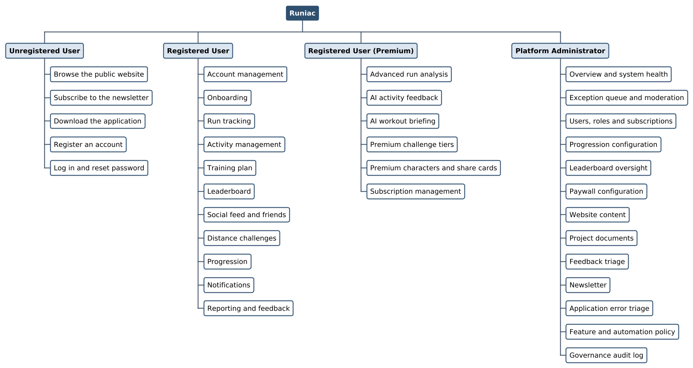{landscape}

*Figure 2.1: Functional hierarchy of the delivered system*

## 2.4 Feature Access Levels

Runiac uses a role-based access model in which core habit-building functionality is available to all registered users and Premium adds guidance, analysis and presentation. Critical progression values (experience, level, streak, division and leaderboard score) are backend-owned. No user role can modify them, including the Platform Administrator, other than through the configuration that governs how they are calculated.

| Feature | Unregistered | Basic | Premium | Platform Administrator |
| --- | --- | --- | --- | --- |
| Browse public website and project documents | ✓ | ✓ | ✓ | ✓ |
| Subscribe to newsletter | ✓ | ✓ | ✓ | ✓ |
| Download application | ✓ | ✓ | ✓ | ✓ |
| View application tour (after sign-up only) | | ✓ | ✓ | |
| Register account | ✓ | | | |
| Log in / log out | | ✓ | ✓ | ✓ |
| Complete onboarding | | ✓ | ✓ | |
| Manage profile, nickname and avatar | | ✓ | ✓ | |
| View home dashboard | | ✓ | ✓ | |
| Start / pause / resume / end run | | ✓ | ✓ | |
| Voice coaching during a run | | ✓ | ✓ | |
| View running history and run summary | | ✓ | ✓ | |
| View basic running analysis | | ✓ | ✓ | |
| View weekly running plan and edit schedule | | ✓ | ✓ | |
| Receive reminders and notifications | | ✓ | ✓ | |
| View experience, level, streak and division | | ✓ | ✓ | |
| View territorial leaderboard and runner profiles | | ✓ | ✓ | |
| Publish an activity to the social feed | | ✓ | ✓ | |
| Like and comment on feed posts | | ✓ | ✓ | |
| Friends: search, request, accept, block | | ✓ | ✓ | |
| Share achievement cards externally | | ✓ | ✓ | |
| Distance challenges below the premium tiers | | ✓ | ✓ | |
| Report content or users | | ✓ | ✓ | |
| Submit feedback; request account deletion | | ✓ | ✓ | |
| Deterministic post-run summary | | ✓ | ✓ | |
| Access advanced run analysis | | | ✓ | |
| Access AI home guide | | ✓ | ✓ | |
| Access AI activity feedback | | | ✓ | |
| Access AI workout briefing | | | ✓ | |
| Publish a route to the social feed | | ✓ | ✓ | |
| Access premium challenge tiers (100 km and above) | | | ✓ | |
| Access premium characters and presentation | | | ✓ | |
| Manage users, roles, subscriptions and account status | | | | ✓ |
| Review reported content and act on it | | | | ✓ |
| Triage application errors and feedback | | | | ✓ |
| Configure progression, paywall, feature and automation policy | | | | ✓ |
| Oversee and re-trigger leaderboard aggregation | | | | ✓ |
| Publish project documents | | | | ✓ |
| Manage website content and newsletter campaigns | | | | ✓ |
| Read the governance audit log | | | | ✓ |

*Table 2.1: Feature access levels as delivered*

## 2.5 System Dependencies

| Dependency | Purpose | Change from the earlier documents |
| --- | --- | --- |
| Flutter and Dart | Cross-platform mobile application | As specified |
| Firebase Authentication | Identity and account management | Google Sign-In delivered; Apple Sign-In not delivered |
| Cloud Firestore | Storage of profiles, activities, plans, routes, social content and progression data | As specified |
| Cloud Functions (TypeScript) | Activity validation, experience calculation, streak evaluation, leaderboard aggregation, entitlement enforcement, notification and moderation logic, AI orchestration | As specified |
| Firebase Cloud Messaging | Delivery of reminders and notifications | As specified, complemented by device-local scheduling through a platform channel |
| Cloud Storage | Avatars, feed thumbnails, share cards, project documents | Not listed in the earlier documents |
| Firebase App Check | Client attestation | Not listed in the earlier documents |
| Mapbox | Route visualisation, live run map, route previews on Activity Feed posts | The earlier documents named a generic "Map Service API"; Mapbox was selected |
| Smartphone GPS and motion sensors | Collection of location, distance and motion data | As specified |
| OpenAI `gpt-4o-mini` via LangChain | Premium AI-assisted summaries, home guidance and workout briefings | The earlier documents named a generic "LLM Service"; this is the delivered provider and model |
| Native platform channels (Swift and Kotlin) | Eight channels: cadence estimation from phone motion and its event stream, Android foreground run-tracking service, iOS Live Activity, haptics, notification permissions, plan reminder scheduling, Instagram Story sharing | Not listed in the earlier documents |
| Next.js and React | Public website and Platform Administrator console | Not listed in the earlier documents |

*Table 2.2: System dependencies as delivered*

## 2.6 Functional Requirements

### 2.6.1 F1: Collect Running-Related Activity Data

| Use Case ID | UC-F1 |
| --- | --- |
| Use Case Name | Collect Running-Related Activity Data |
| Primary Actor | Registered User (Basic or Premium) |
| Supporting Actors | Smartphone GPS and motion sensors, Cloud Functions, Cloud Firestore |
| Preconditions | The user is authenticated and has completed onboarding. Location permission has been granted. |
| Trigger | The user starts a run from the run screen. |
| Main Flow | 1. The user opens the run screen and confirms the pre-run setup. 2. The system samples location and motion, tracking distance, pace, active time and paused time, and draws the route live on the map. 3. The user may pause and resume the run. 4. The user ends the run and confirms the activity. 5. The client submits the activity to the `completeRun` callable function, which validates it and, on success, writes the activity, its summary, the experience award and the leaderboard contribution. 6. The system displays the run summary. |
| Alternate Flow | 1a. If location permission is refused, the run cannot start and the system explains what is required. 2a. If connectivity is lost, tracking continues on the device and submission occurs when connectivity returns. 5a. If validation fails, the activity is recorded with a failed status and earns no experience. 5b. If the user confirms a low-data save, the activity is stored but earns no experience. |
| Postconditions | A validated activity and its summary are persisted, and are available to F2, F6, F8, F9 and F10. |

*Table 2.3: UC-F1 use case description*

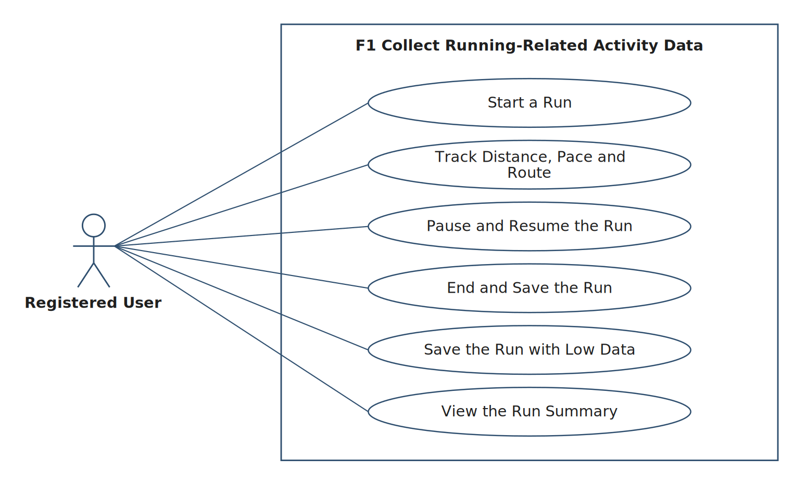

*Figure 2.2: F1 use case diagram*

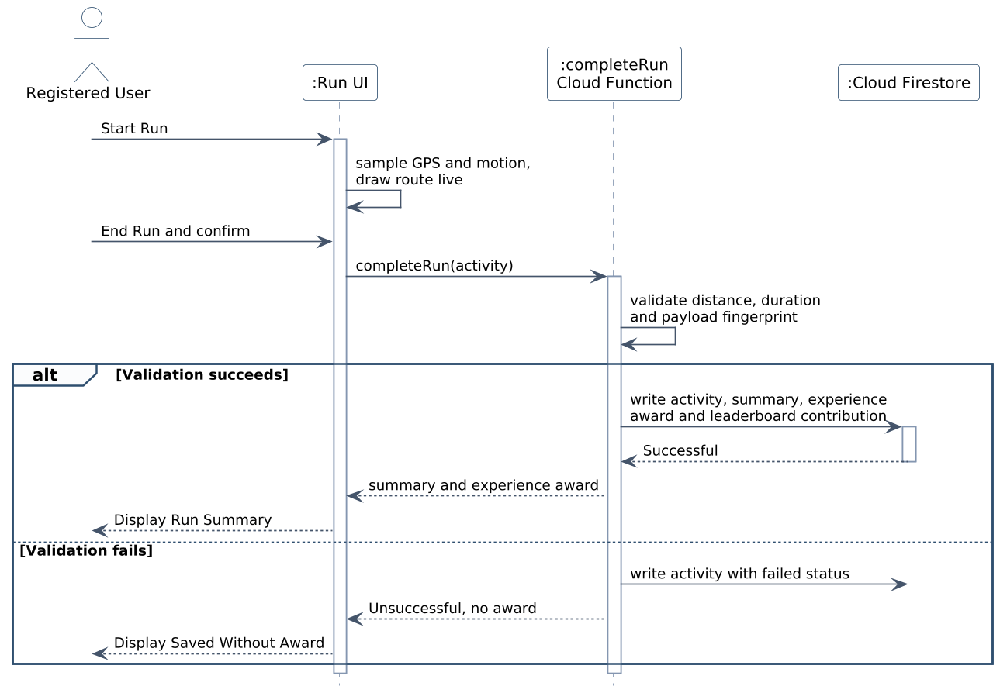

*Figure 2.3: F1 sequence diagram: tracking a run and submitting it to the `completeRun` callable function*

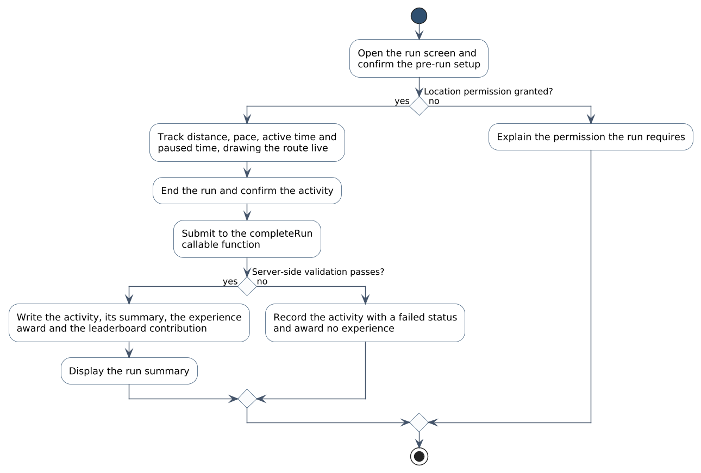

*Figure 2.4: F1 activity diagram: from pre-run setup through tracking to server-side validation*

### 2.6.2 F2: Estimate Running Effects and Provide Analysis

| Use Case ID | UC-F2 |
| --- | --- |
| Use Case Name | Estimate Running Effects and Provide Analysis |
| Primary Actor | Registered User (Basic or Premium) |
| Supporting Actors | Cloud Functions, Cloud Firestore |
| Preconditions | At least one validated activity exists from UC-F1. |
| Trigger | An activity completes, or the user opens the run summary, activity history or progress view. |
| Main Flow | 1. On completion of a run the backend generates a summary holding distance, duration, active duration and average pace. 2. The user opens the run summary and reviews that run. 3. The user opens activity history for earlier runs, or the progress view for totals and recent trend. 4. A Premium user may open advanced analysis, which adds a cadence series and split detail. 5. Results are shown through beginner-oriented components rather than raw tables. |
| Alternate Flow | 4a. If a Basic user selects advanced analysis, the paywall is presented; the server independently refuses the request without entitlement. 1a. Analysis series submitted by the client are bounded and validated server-side before storage. |
| Postconditions | Summary and analysis are available to the user and feed F3, F9 and F10. |

*Table 2.4: UC-F2 use case description*

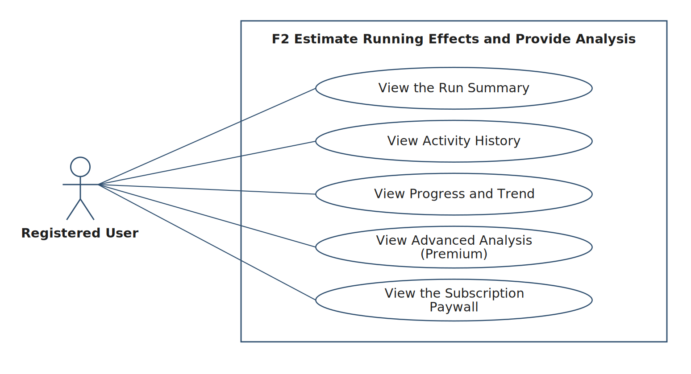

*Figure 2.5: F2 use case diagram*

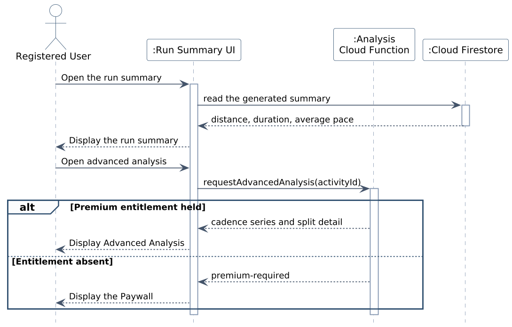

*Figure 2.6: F2 sequence diagram: reading a run summary and requesting advanced analysis*

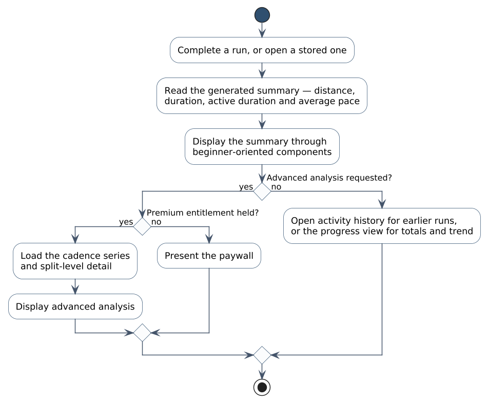

*Figure 2.7: F2 activity diagram: summary generation and the entitlement gate on advanced analysis*

### 2.6.3 F3: Supply Running Advice and Schedule a Running Plan

| Use Case ID | UC-F3 |
| --- | --- |
| Use Case Name | Supply Running Advice and Schedule a Running Plan |
| Primary Actor | Registered User (Basic or Premium) |
| Supporting Actors | Cloud Functions, Cloud Firestore |
| Preconditions | Onboarding is complete, providing goal, experience level, availability, preferred days and times, session length and health considerations. |
| Trigger | The user completes onboarding, opens the plan view, or completes a run that updates adaptive estimates. |
| Main Flow | 1. Onboarding answers are resolved into a safety band, a starting runner level and a plan style. 2. The system generates a weekly plan carrying a plan identifier and kind, title, duration in weeks, the resolved safety band, a plan family, a start date and the designated rest days, and stores it as the user's generated plan. 3. The user reviews the plan preview at the end of onboarding and thereafter in the plan view. 4. The user may edit the schedule, adjusting which days and times sessions fall on. 5. Completion of planned sessions is recorded in a separate progress ledger. 6. Adaptive estimates of pace and session duration are maintained and refine later sessions. |
| Alternate Flow | 1a. Where health answers indicate caution, the resolved safety band produces a more conservative plan. 4a. Rest days designated by the plan are recorded as protected dates and consumed by F6 so that a planned rest does not break a streak. |
| Postconditions | A current weekly plan exists and is available to F4, F6 and F9. |

*Table 2.5: UC-F3 use case description*

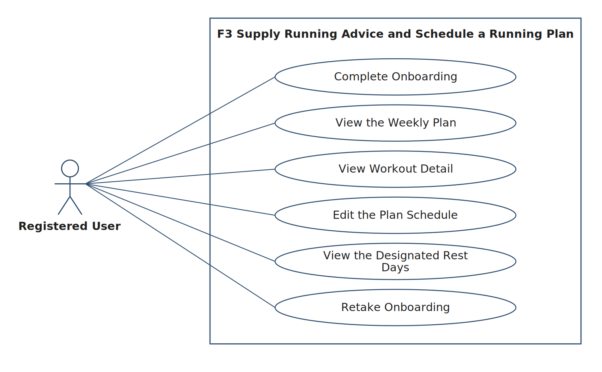

*Figure 2.8: F3 use case diagram*

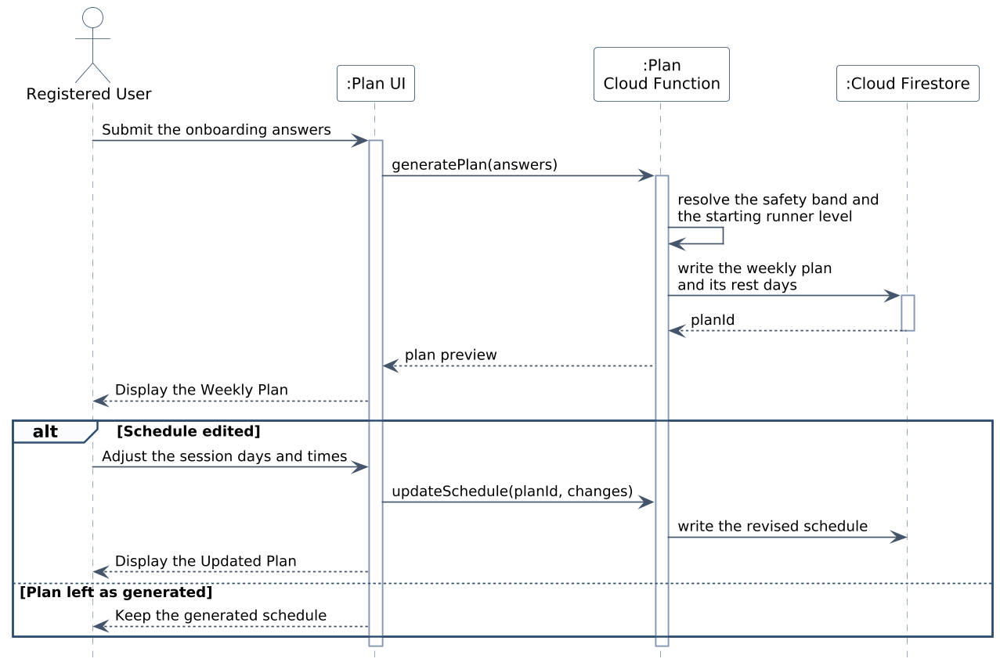

*Figure 2.9: F3 sequence diagram: generating a weekly plan from onboarding answers and editing its schedule*

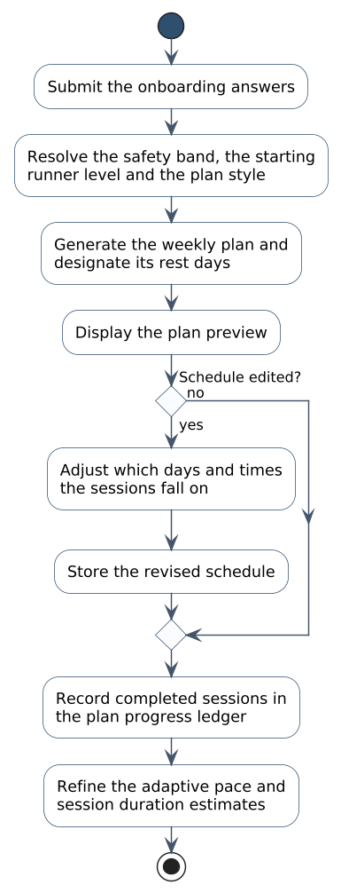

*Figure 2.10: F3 activity diagram: plan generation, schedule editing and adaptive refinement*

### 2.6.4 F4: Remind the User of Running or Rest

| Use Case ID | UC-F4 |
| --- | --- |
| Use Case Name | Remind the User of Running or Rest |
| Primary Actor | Registered User (Basic or Premium) |
| Supporting Actors | Cloud Functions, Cloud Firestore, Firebase Cloud Messaging |
| Preconditions | Notification permission has been granted and a plan exists from UC-F3. |
| Trigger | A plan is created or edited, the scheduled dispatch function runs, or an event such as feed engagement produces a notification. |
| Main Flow | 1. The client registers its messaging token so that the backend can address the device. 2. When a plan is created or changed, the client schedules device-local reminders and records them so the same reminder is not scheduled twice. 3. A scheduled function runs every ten minutes and dispatches queued push notifications. 4. Event-driven notifications are queued as their triggering events occur. 5. Notifications are delivered and recorded in the in-application inbox. 6. The user opens a notification and is taken to the relevant screen, or reads it later from the inbox. |
| Alternate Flow | 1a. If notification permission is refused, reminders and push delivery are unavailable; inbox items are still recorded and readable. 4a. Notification preferences suppress categories the user has disabled. 3a. Scheduled dispatch can be disabled centrally from the console without a deployment. |
| Postconditions | Reminders are delivered or queued, and delivery is recorded. |

*Table 2.6: UC-F4 use case description*

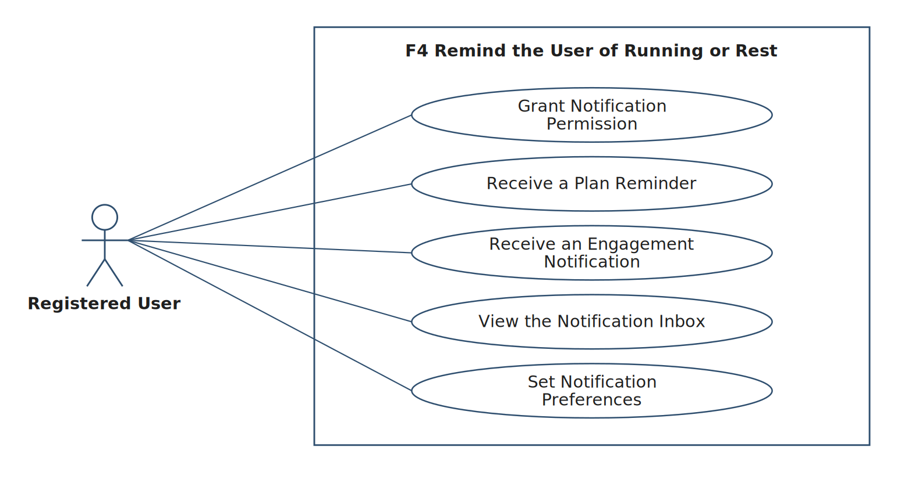

*Figure 2.11: F4 use case diagram*

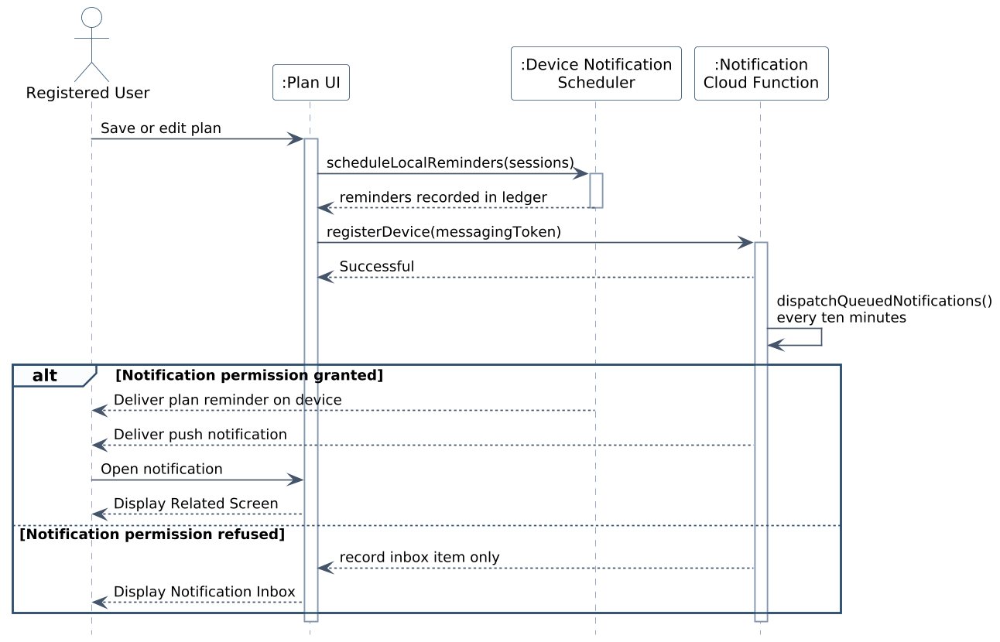

*Figure 2.12: F4 sequence diagram: device-local reminder scheduling alongside backend push dispatch*

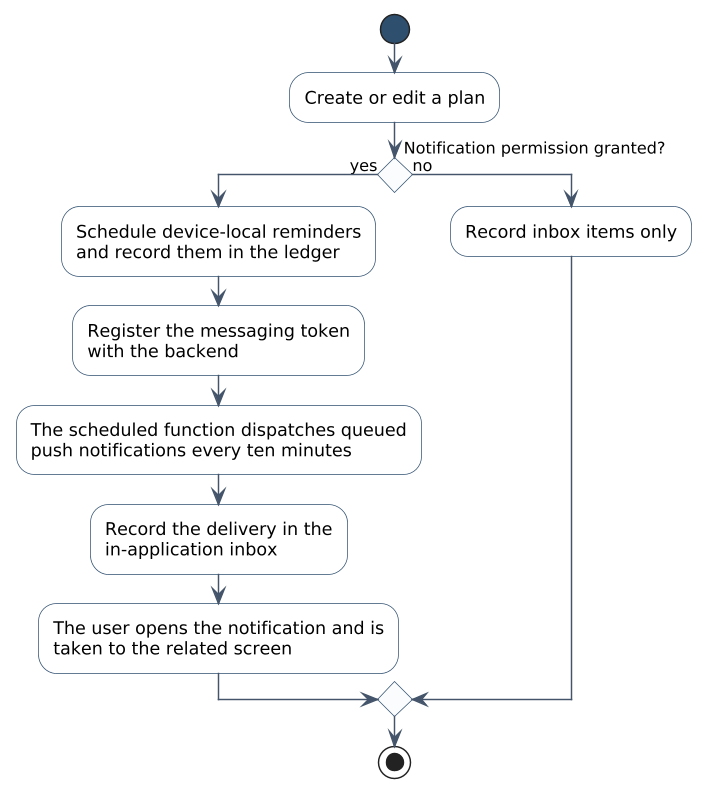

*Figure 2.13: F4 activity diagram: parallel device-local and backend notification paths*

### 2.6.5 F5: Social Connection, Sharing and Competition

F5 delivers three related capabilities: publishing to the in-application social feed, sharing outward to external platforms, and competing directly with friends through distance challenges. All three are described in one use case because they share the same actors, entitlement model and moderation path.

| Use Case ID | UC-F5 |
| --- | --- |
| Use Case Name | Connect Socially, Share Achievements and Compete in Challenges |
| Primary Actor | Registered User (Basic or Premium) |
| Supporting Actors | Cloud Functions, Cloud Firestore, Cloud Storage, Platform Administrator (moderation) |
| Preconditions | The user is authenticated. For publication and sharing, at least one completed activity exists. |
| Trigger | The user publishes an activity to the feed, taps share on a summary or achievement, opens the friends area, or opens the challenge area. |
| Main Flow (feed) | 1. The user publishes a completed activity to the feed. 2. The publication function checks entitlement, generates a thumbnail and writes the post. 3. Other users see the post with the author's level badge, and may like or comment. 4. Engagement notifies the author through F4. |
| Main Flow (friends) | 5. The user searches for another runner and sends a friend request. 6. The recipient accepts or declines. 7. Friends appear in the friends list with their levels, and may be blocked or removed. |
| Main Flow (external sharing) | 8. The user selects a run summary, an achievement card or a leaderboard rank to share. 9. The system composes a share card, applying premium presentation where the user is entitled. 10. The share sheet opens and the user selects a destination or cancels. |
| Main Flow (challenges) | 11. The user selects a distance tier from the challenge catalogue. 12. The user creates a lobby, or accepts an invitation to one, and invites friends. 13. The lobby creator starts the challenge. 14. Distance from each participant's validated runs counts toward the goal. 15. A scheduled function closes the challenge at its deadline, awards badges and records the result. |
| Alternate Flow | 2a. Publication is gated on the server against the `shareRouteToFeed` key, which is configured at the Basic tier, so every registered user may publish. 11a. Challenge tiers at or above one hundred kilometres are premium; an unentitled start is refused server-side. 3a. Any user may report a post or another user, which enters the moderation queue. 12a. A user may withdraw from a lobby, and the creator may cancel it, before the challenge starts. |
| Postconditions | Feed posts, friendships, share events and challenge results are persisted. Feed content is readable by clients only when published, and never writable directly. |

*Table 2.7: UC-F5 use case description*

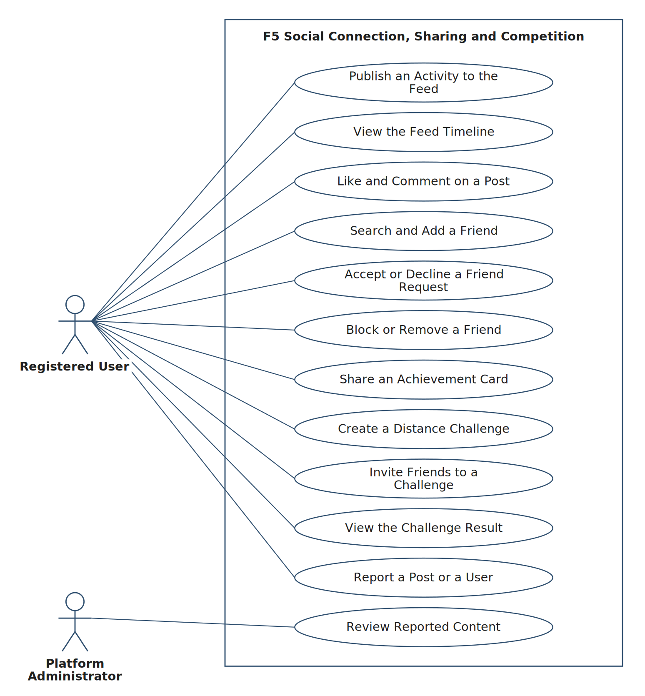

*Figure 2.14: F5 use case diagram*

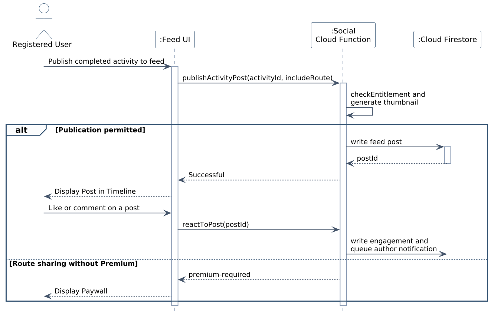

*Figure 2.15: F5 sequence diagram: publishing an activity to the feed and engaging with a post*

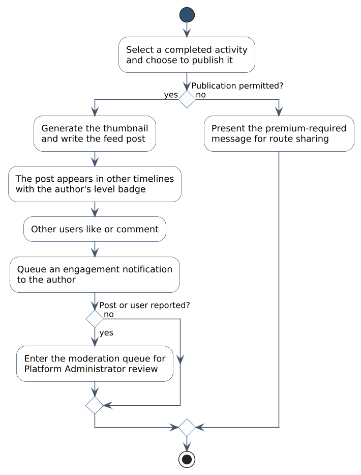

*Figure 2.16: F5 activity diagram: feed publication, engagement and the moderation path*

### 2.6.6 F6: Streak and Consistency Tracking

| Use Case ID | UC-F6 |
| --- | --- |
| Use Case Name | Track Streak and Consistency |
| Primary Actor | Registered User (Basic or Premium) |
| Supporting Actors | Cloud Functions, Cloud Firestore |
| Preconditions | At least one validated activity exists. |
| Trigger | An activity is validated, or the user opens the home dashboard. |
| Main Flow | 1. When an activity is validated, the backend re-derives the streak from the user's activity history rather than trusting the stored value. 2. A same-day run leaves the streak unchanged, a next-day run increments it, and a longer gap resets it. 3. If every day in the gap is a protected rest day from the user's plan, the streak continues instead. 4. Crossing a milestone at three, seven, fourteen or thirty days awards a bonus of 30, 90, 220 or 600 experience points. 5. The user sees current streak, longest streak and progress on the home dashboard. |
| Alternate Flow | 2a. If no qualifying activity occurs in the window the streak lapses, and an on-demand refresh keeps the display correct without waiting for the next run. 4a. Milestone bonuses are paid once only and are exempt from the experience caps. |
| Postconditions | Streak state and milestone high-water mark are updated and consumed by F9. |

*Table 2.8: UC-F6 use case description*

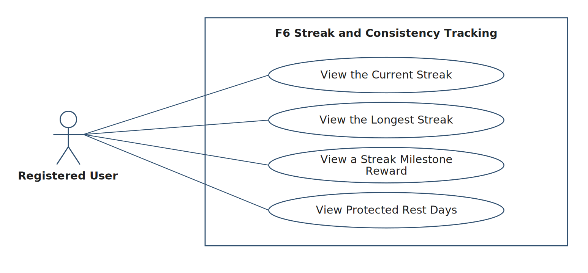

*Figure 2.17: F6 use case diagram*

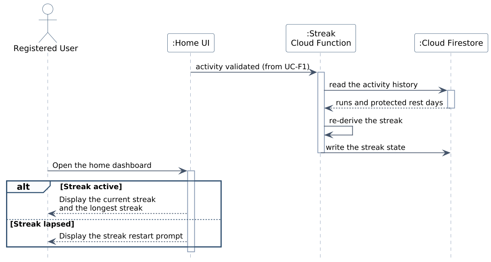

*Figure 2.18: F6 sequence diagram: re-deriving the streak baseline after validation and reading streak status*

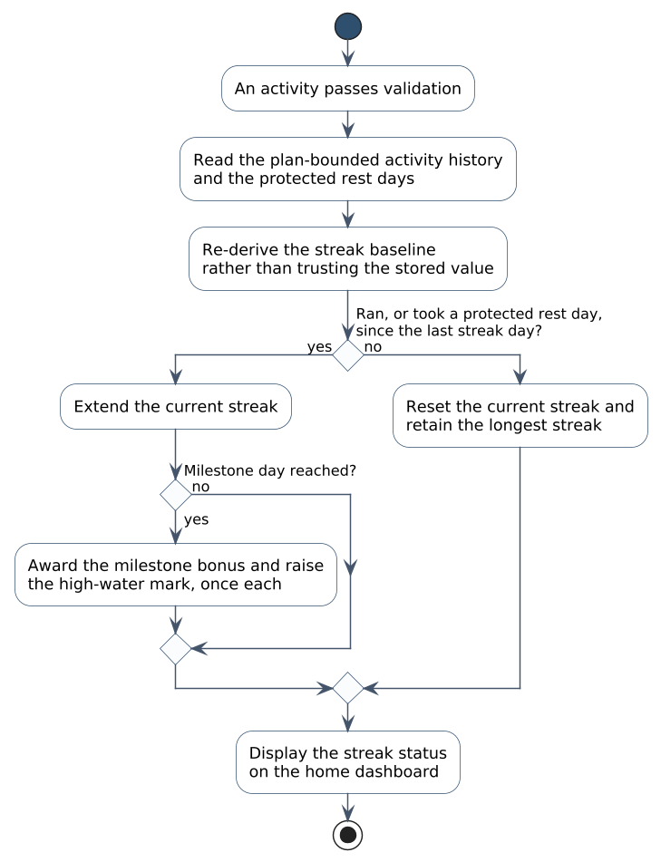

*Figure 2.19: F6 activity diagram: re-deriving the streak, protected rest days and milestone awards*

### 2.6.7 F7: Community-Driven Route Sharing

| Use Case ID | UC-F7 |
| --- | --- |
| Use Case Name | Share a Run and its Route through the Activity Feed |
| Primary Actor | Registered User (Basic or Premium) |
| Supporting Actors | Cloud Functions, Cloud Firestore, Cloud Storage, Mapbox, Platform Administrator (moderation) |
| Preconditions | The user has a validated run with a recorded route, or wishes to see runs shared by others. |
| Trigger | The user publishes a completed run to the Activity Feed, or opens the Feed to see runs shared by others. |
| Main Flow | 1. The user opens a completed run from activity history and chooses to publish it to the Activity Feed, with its route included. 2. The publication function checks entitlement, quantises the route coordinates and renders a route preview image. 3. The feed post is written and appears in other runners' timelines with the route preview. 4. Another runner opens the post and sees the route, the distance and the pace. 5. Any runner may report a post, which enters the moderation queue for Platform Administrator review. |
| Alternate Flow | 1a. A run that failed validation or carries too little data offers no publish action. 2a. Publication is gated by the `shareRouteToFeed` feature key, which is configured at the Basic tier, so every registered user may publish. The gate exists so that the tier can be changed from the console without a release. 4a. Where no runner in the timeline has published, an empty state is shown. |
| Postconditions | A feed post exists carrying the run and its coarsened route preview, and is readable by other runners through the Activity Feed. |

*Table 2.9: UC-F7 use case description*

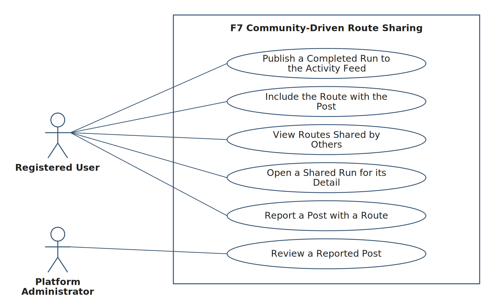

*Figure 2.20: F7 use case diagram*

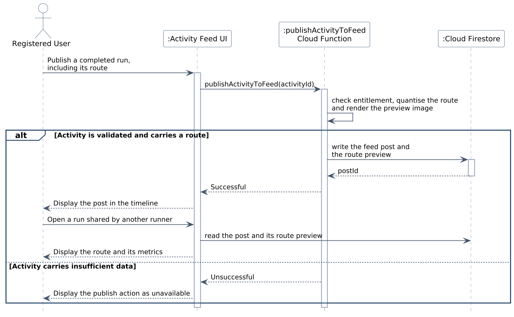

*Figure 2.21: F7 sequence diagram: publishing a run with its route to the Activity Feed*

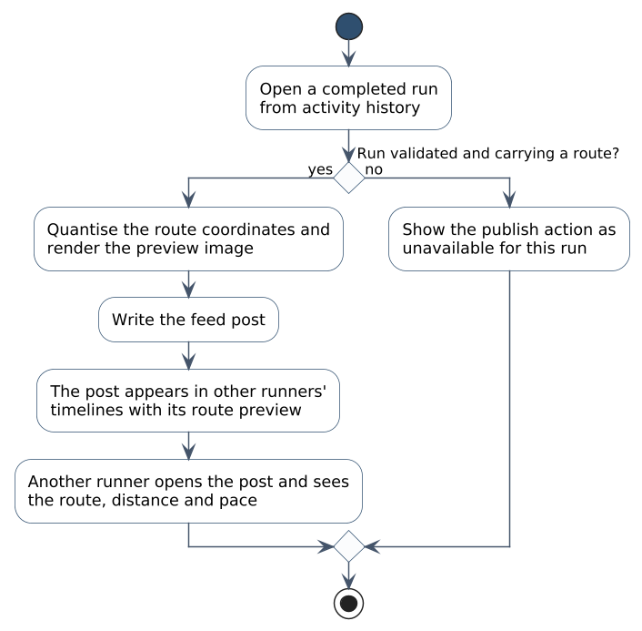

*Figure 2.22: F7 activity diagram: publishing a run to the Activity Feed and reporting a post*

**What is and is not delivered.** The earlier documents described a separate route library with browsing, searching and saving. That library is not delivered: the `sharedRoutes` collection stores no coordinates, no code path publishes a route into it, and the screens written against it have no navigation entry point in the delivered build. What is delivered against the intent of this requirement is the Activity Feed. A runner publishes a completed run with its coarsened route preview, and every other runner sees that route in their timeline. Chapter 9 carries the separate route library as outstanding work.

### 2.6.8 F8: Level-Based Territorial Leaderboard

| Use Case ID | UC-F8 |
| --- | --- |
| Use Case Name | View and Participate in the Level-Based Territorial Leaderboard |
| Primary Actor | Registered User (Basic or Premium) |
| Supporting Actors | Cloud Functions, Cloud Firestore, Platform Administrator (oversight) |
| Preconditions | The user has at least one validated activity in a recognised region within the current period. |
| Trigger | The user opens the leaderboard, or the scheduled aggregation function runs. |
| Main Flow | 1. Each validated run writes a contribution for the current month and the Singapore planning area in which it occurred. 2. The scheduled aggregation function runs every sixty minutes under a lease that prevents concurrent runs. 3. Contributions are grouped by region and level division, filtered for eligibility and ordered by score. 4. The function publishes the ranking snapshot, a per-user rank document and a current-view document for fast reads. 5. The user opens the leaderboard and sees their region and division, their own position and the runners around them. 6. The user may open another runner's public profile from the ranking. |
| Alternate Flow | 3a. A user below the minimum qualifying run count is excluded from ranking for that period. 2a. If a previous aggregation still holds the lease, the run is skipped rather than duplicated. 5a. A user not yet ranked sees the board with their pending status shown. 2b. The Platform Administrator may trigger a recalculation and inspect coverage. |
| Postconditions | The published ranking reflects validated activity. No client read triggers a computation, and Premium confers no advantage. |

*Table 2.10: UC-F8 use case description*

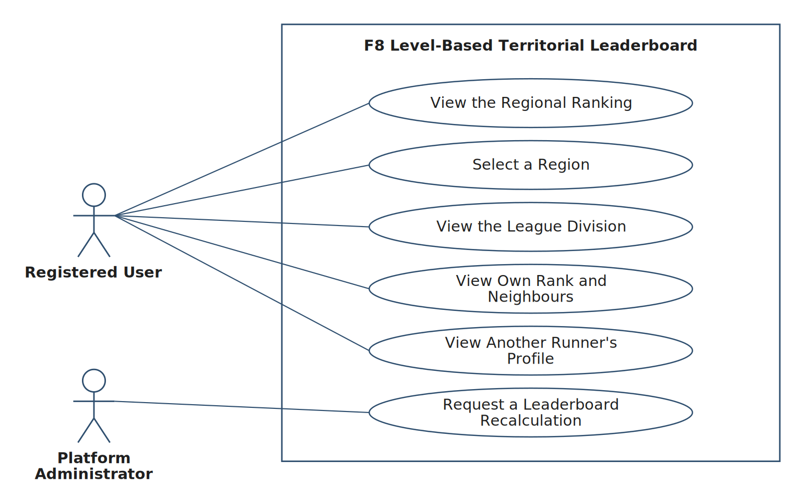

*Figure 2.23: F8 use case diagram*

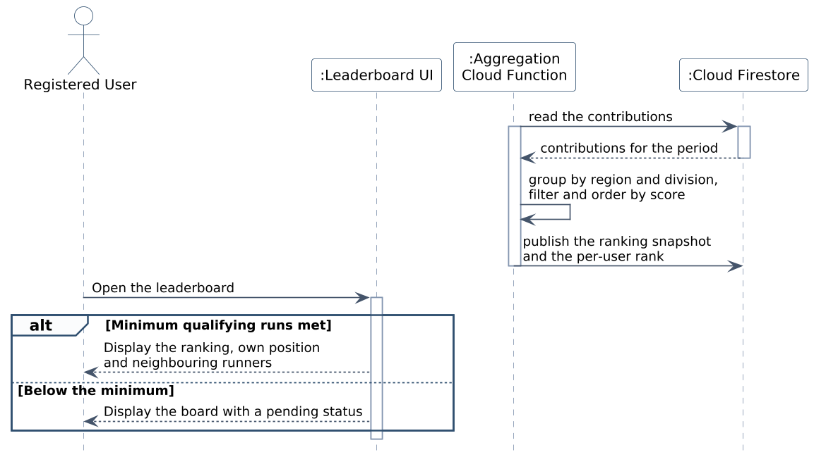

*Figure 2.24: F8 sequence diagram: scheduled leaderboard aggregation and a user reading the ranking*

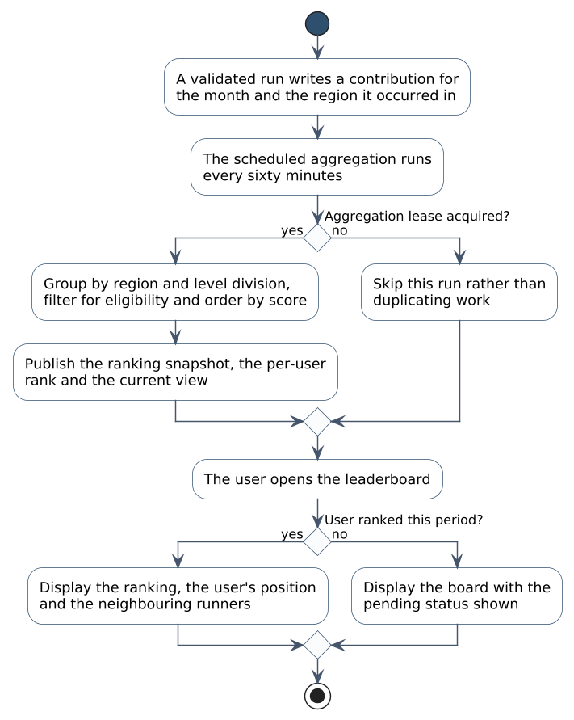

*Figure 2.25: F8 activity diagram: leased aggregation, eligibility filtering and ranked publication*

### 2.6.9 F9: Runner Level and Experience Point Progression

| Use Case ID | UC-F9 |
| --- | --- |
| Use Case Name | Earn Experience and Progress Through Runner Levels |
| Primary Actor | Registered User (Basic or Premium) |
| Supporting Actors | Cloud Functions, Cloud Firestore, Platform Administrator (configuration) |
| Preconditions | A run has been submitted through UC-F1. |
| Trigger | An activity passes server-side validation. |
| Main Flow | 1. The backend computes the award from a base of 20 for completion, 10 for each kilometre, 5 for each ten minutes of active time, and 20 for fulfilling a planned session. 2. The award is capped at 100 for the activity, then limited so the day's total does not exceed 200. 3. A completed cool-down adds a further bonus, and any streak milestone from UC-F6 is added exempt from both caps. 4. Total experience is updated and the level recomputed against the level curve in Table 2.12, to a maximum of level 100. 5. The level sets the league division, one of ten leagues of ten levels from Iron to Challenger. 6. An entry is written to the progression audit ledger, and the user sees the award and any level change. |
| Alternate Flow | 1a. An activity saved with the low-data option earns no experience. 2a. Once the daily cap is reached, further activity is recorded but earns nothing more that day. 5a. A level change reaches the leaderboard on the next aggregation cycle of UC-F8. 1b. The Platform Administrator may retune every value here through configuration; an invalid configuration falls back to the compiled defaults. |
| Postconditions | Total experience, level and division are updated, and an immutable audit entry exists for the award. |

*Table 2.11: UC-F9 use case description*

| Component | Value |
| --- | --- |
| Base completion | 20 XP |
| Distance | 10 XP per completed kilometre |
| Active duration | 5 XP per completed ten minutes |
| Plan completion bonus | 20 XP |
| Per-activity cap | 100 XP |
| Daily cap | 200 XP |
| Cool-down bonus | 20% of base, rounded to nearest 5, bounded 5–20 XP |
| Streak milestones | 30, 90, 220, 600 XP at 3, 7, 14, 30 days, once each |
| Level increments by band | 100, 150, 220, 300, 400, 520, 660, 820, 1000, 1200 |
| Maximum level | 100 |
| Leagues | 10 leagues of 10 levels, Iron through Challenger |

*Table 2.12: Experience point and level model as deployed*

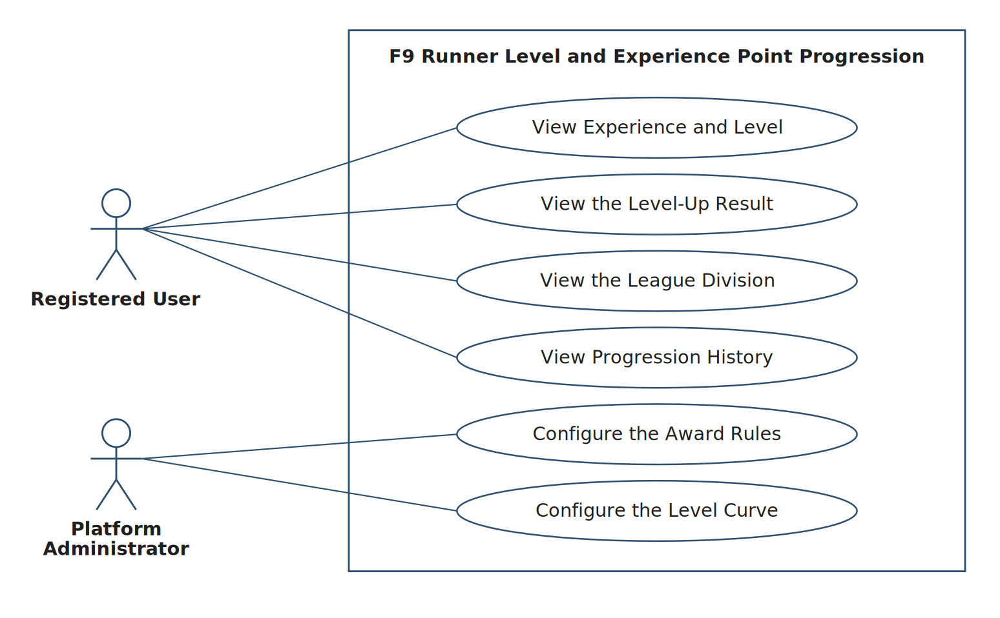

*Figure 2.26: F9 use case diagram*

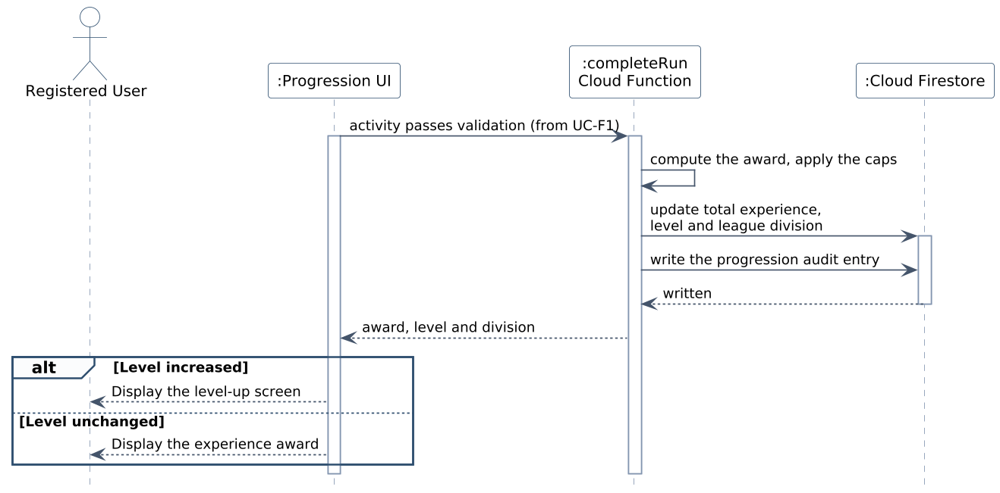

*Figure 2.27: F9 sequence diagram: computing the experience award, applying caps and updating the level*

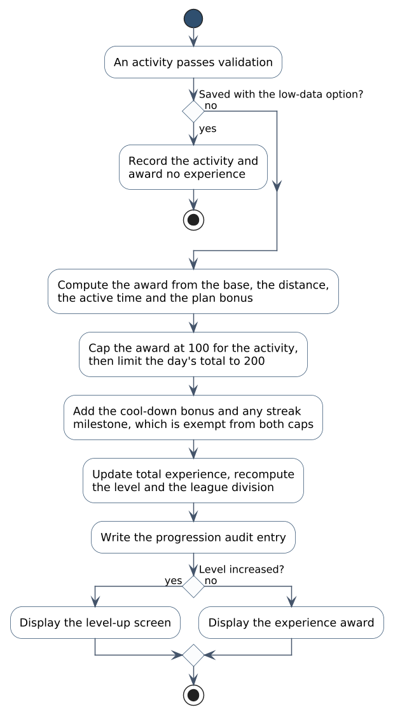

*Figure 2.28: F9 activity diagram: award computation, cap application and level recomputation*

### 2.6.10 F10: AI-Assisted Post-Run Summary

| Use Case ID | UC-F10 |
| --- | --- |
| Use Case Name | Generate AI-Assisted Guidance and Post-Run Reflection |
| Primary Actor | Registered User (Basic or Premium) |
| Supporting Actors | Cloud Functions, Cloud Firestore, external language model provider |
| Preconditions | A validated activity exists, a planned session is upcoming, or the user opens the home dashboard. The home guide additionally requires explicit consent. |
| Trigger | The user opens activity feedback after a run, opens a workout briefing before a session, or opens the home dashboard. |
| Main Flow | 1. The backend assembles a context from the user's verified activity data, plan state and recent history. 2. Entitlement, the daily quota and, for the home guide, a per-day cache are checked. 3. The backend calls the language model with a prompt that forbids medical language and references to experience, level or ranking. 4. The returned text is re-validated against medical-term patterns and length limits before acceptance. 5. The result is stored and presented as readable reflection or guidance. |
| Alternate Flow | 2a. A Basic user reaches the paywall for activity feedback and the workout briefing. Only the home guide, configured at the Basic tier, generates for an unentitled user. 2b. When the daily quota is exhausted, five generations per surface per day, the surface degrades to non-personalised copy without stating when the quota resets. Manual scripts 6.2.1 and 6.2.3 record this as a defect. 2c. A home guide request matching the cached context returns the cached result without calling the model. 3a. If the provider is unavailable, or validation rejects the text, deterministic copy is used instead. |
| Postconditions | Guidance is stored and displayed, generated within quota, and constrained so that it neither offers medical advice nor references competitive standing. |

*Table 2.13: UC-F10 use case description*

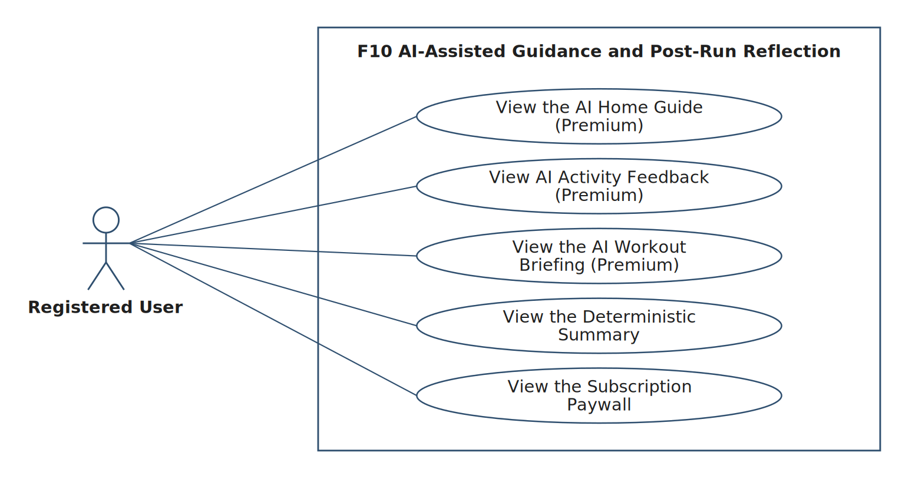

*Figure 2.29: F10 use case diagram*

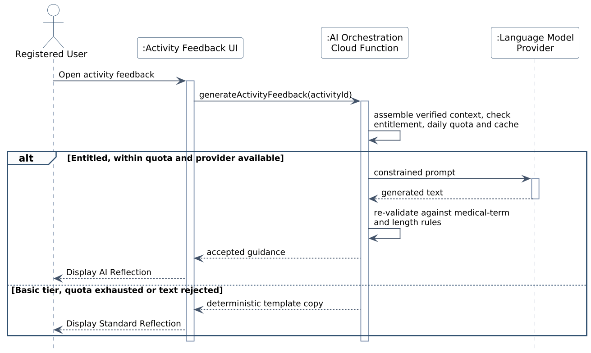

*Figure 2.30: F10 sequence diagram: generating activity feedback with entitlement, quota and safety fallback*

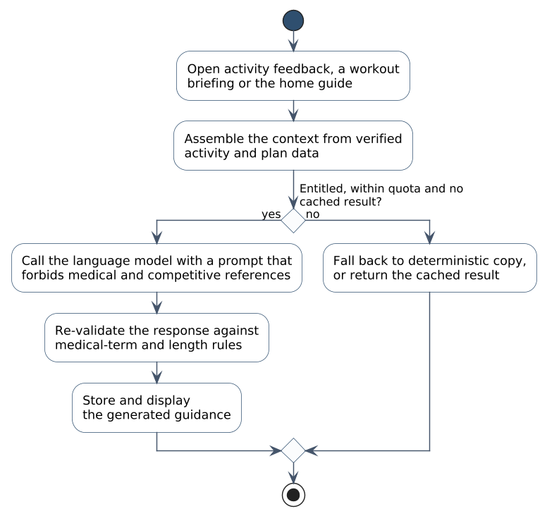

*Figure 2.31: F10 activity diagram: entitlement, quota, cache, safety validation and fallback*

## 2.7 Non-Functional Requirements

Runiac handles running activities, GPS routes, health-related onboarding data, progression records and community-generated content. Beyond implementing the features above, the system must remain secure, private, reliable, responsive and suitable for beginner runners. The requirements below are the second version of the seven non-functional requirements stated in the Preliminary Technical Document, with two additions the earlier documents did not state as testable requirements.

### 2.7.1 NF1: Security and Authentication

**Requirement.** Authentication shall use trusted third-party identity providers through Firebase Authentication; credentials shall not be stored by the client; role-based access control shall separate permissions between roles; premium functionality shall be enforced through backend entitlement validation rather than client determination; and sensitive operations (experience calculation, streak updates, level progression, leaderboard aggregation and route publication) shall be processed by backend services rather than by clients.

**As delivered.** Identity is handled by Firebase Authentication, with Google Sign-In in the mobile application and email, password and Google on the web tier. No credential is stored by the client. Firebase App Check is integrated.

Role-based access is delivered against the three-role model in Section 2.2. Authorisation is enforced in depth rather than at a single boundary. The Firestore security rules run to roughly fourteen hundred lines and close with a deny-all catch-all, so a collection is unreachable unless a rule explicitly opens it. The `users` collection is readable only by its owner and writable by no client, because every field on it that matters (subscription status, role, account status) is server-owned. The profile collection is owner-writable but with an enumerated set of backend-owned keys the owner cannot touch, which protects experience, level, streak and division while allowing a user to change their own nickname. Administrative command collections, notification devices and deliveries, leaderboard contributions and locks, feedback, moderation and newsletter data are denied to clients entirely and reached only through the Admin SDK.

Premium entitlement is validated on the server against a feature-key catalogue; a denial returns an explicit premium-required reason. Every sensitive operation named in the requirement is performed by Cloud Functions, and the fields they produce are rejected if a client attempts to submit them.

Administrative authorisation is separate and stronger: the console verifies a revocation-checked session cookie, identifies an administrator from the role field, and re-verifies authorisation inside every mutating action rather than only at the layout boundary.

**Verification.** Exercised by the entitlement, role, account-status and ownership tests in the Cloud Functions suite reported in Chapter 7, and by manual test cases covering sign-in, sign-out, password reset, expired session handling and unauthorised access attempts.

**Not delivered.** Apple Sign-In, specified alongside Google Sign-In, was not implemented. It is a prerequisite for App Store submission and is carried into Chapter 9.

### 2.7.2 NF2: Privacy, Health-Related Data Protection and PDPA Compliance

**Requirement.** Personal, health-related and location data shall be handled in accordance with data protection principles including Singapore's Personal Data Protection Act. Only necessary data shall be collected; users shall be informed during onboarding what health-related data is collected; location shall be collected only when run-tracking or route functionality requires it; sensitive information shall not be publicly displayed or shared without explicit authorisation; and route sharing shall incorporate privacy protection, with shared routes remaining private until the user explicitly submits them.

**As delivered.** Onboarding states what is being asked and why, and health-related answers are stored under the user's own document, readable only by that user, and never surfaced to others. Location is sampled only during an active run or when route functionality is in use. Profiles are private by default and every sharing action is explicit. Publishing to the feed, sharing a route, sharing externally and accepting a friend request are all deliberate acts, and a route remains private until the user shares it.

Storage rules deny public access to avatars and project documents outright and scope staging areas to their owner. The system ships privacy, terms, cookie and account-deletion policy pages on the website, an in-application privacy and safety screen, blocking and reporting controls, and a self-service account deletion flow implemented as a callable that raises an administrative deletion command.

Publication under F7 means publication to the social feed as part of a completed activity. Where a route is published in that way, its route preview is bounded and its coordinates are quantised to three decimal places, coarsening published positions to roughly one hundred metres. This quantisation applies to the activity route preview, which is the only route any other runner can see. The `sharedRoutes` collection written for the undelivered route library carries no coordinates at all.

**Verification.** Verified by the access-control tests in Chapter 7, by inspection of the security and storage rules, and by manual test cases confirming that health answers, private activity and precise location do not appear on any screen visible to another user.

**Not delivered.** User-defined privacy zones, which mask route start and end points near sensitive locations, were not implemented. The delivered protection should not be described as equivalent.

### 2.7.3 NF3: Cross-Platform Compatibility and Device Responsiveness

**Requirement.** The application shall operate on iOS and Android through a single Flutter codebase, with core functionality available on both; the interface shall adapt to common screen sizes without layout breakage, overlapping content, unreadable text or inaccessible controls; and the system shall degrade gracefully when GPS, notifications or connectivity are temporarily unavailable.

**As delivered.** A single Dart codebase targets both platforms, with native project structures maintained for each and platform-specific work confined to foreground location behaviour, device-local notification scheduling through a platform channel, and an iOS live activity target. The interface is built on a shared design system of theme, colour and component modules rather than platform-specific variants, and navigation is uniform.

Graceful degradation is delivered concretely. Run tracking continues locally when connectivity is lost and synchronises on return; AI-assisted surfaces fall back to deterministic copy when the provider is unavailable; error reports queue locally and are delivered later; and repository interfaces have in-memory implementations so the client remains functional when a backend service is unreachable.

**Verification.** Verified by executing the core flows on at least one Android and one iOS device, and by reviewing key screens at different screen sizes. The manual test scripts in the annex record the devices used.

### 2.7.4 NF4: Data Storage, Backup and Data Integrity

**Requirement.** Critical user data shall be stored in a persistent cloud database; completed activities shall synchronise after completion with temporary local storage used during active sessions; experience, levels, streaks, leaderboard scores and ranking calculations shall be backend-owned, generated exclusively by Cloud Functions, with clients only displaying them; and the system shall reject or flag suspicious activity data including unrealistic speed, abnormal GPS movement, duplicate submissions, incomplete route records and activities failing minimum validity requirements.

**As delivered.** Cloud Firestore holds all persistent data. During a run the client keeps session state locally and submits on completion; local storage also backs settings, tour state, plan completion markers, the notification ledger, character selection, onboarding drafts and queued error reports.

Backend ownership is enforced structurally rather than by convention. A submitted run is rejected outright if it carries any field outside an allow-list, or any server-owned field: experience, totals, weekly and monthly experience, streak, level, rank, score, subscription status, role, validation status. The same field set is denied at the security-rule layer, so neither path is available to a client.

Validation covers scalar bounds (duration at most 86,400 seconds, distance at most 100,000 metres, pace between 120 and 3,600 seconds per kilometre) and internal consistency, requiring duration, active duration, paused time and wall-clock elapsed to agree within sixty seconds. The pace implied by distance and duration must match the reported pace within two per cent or fifteen seconds per kilometre, whichever is larger. A completion timestamp more than six hours in the future is rejected, and the instant used to assign a run to a daily cap or leaderboard month is clamped to server time so a future timestamp cannot select a favourable period. Duplicate submissions are neutralised by deterministic document identifiers and a payload fingerprint. Suspended, banned and deleting accounts are refused.

**Verification.** This requirement carries the heaviest automated coverage in the project. The validation, calculation and contract tests in the Cloud Functions suite exercise the allow-list, scalar bounds, consistency checks, freshness clamp and idempotency guard; results are in Chapter 7.

**Not delivered.** Detection of abnormal GPS movement was specified and not implemented. Validation is scalar and structural rather than geometric. Route validation bounds the shape of the preview to at most sixty-four segments and two hundred and fifty-six points, and does not analyse it for speed outliers or position jumps. There is also no server-side minimum distance or duration; those minima are applied by the client only.

### 2.7.5 NF5: Performance and Responsiveness

**Requirement.** Common read operations should complete within two to three seconds under stable network conditions; activity synchronisation should complete within five to ten seconds; and leaderboard rankings should be served from pre-aggregated backend records rather than recalculated per client request.

**As delivered.** The pre-aggregation requirement is satisfied by design: leaderboard reads hit a snapshot, a rank document or a current-view document, all written by the scheduled aggregator, and no client read triggers a ranking computation. Fifteen composite indexes support the query patterns for activities, run summaries, challenges, feed posts, reports, friends, friend requests, blocked users, feedback, newsletter subscribers and challenge invitations. Feed and history reads carry explicit result limits enforced within the security rules themselves, bounding both latency and cost. AI guidance is cached per user per day against a context fingerprint, so an unchanged situation incurs no model call.

**Verification.** Measured timings for dashboard load, activity synchronisation, leaderboard load and summary generation are reported in Chapter 7 against the stated targets.

### 2.7.6 NF6: Availability and Reliability

**Requirement.** The system should remain available during normal operating conditions except for scheduled maintenance; it should continue functioning under temporary connectivity interruptions by preserving locally buffered activity data until synchronisation becomes possible; and critical user information (completed activities, training plans, route submissions and progression records) should not be lost due to temporary network failure or unexpected application interruption.

**As delivered.** The backend is a managed serverless platform, so availability rests on the provider rather than on team-operated infrastructure. Buffering is delivered as described under NF3: a run in progress is held on the device and submitted when connectivity returns, and the submission path is idempotent so that a retry after an interrupted attempt cannot double-award or duplicate the activity.

Reliability is reinforced in three further places the earlier documents did not anticipate. Leaderboard aggregation runs under a lease document, so a slow or overlapping invocation cannot corrupt a period's results. Streak, longest streak and total distance are recomputed from validated history on each run rather than incremented in place, so a lost update cannot leave a profile permanently wrong. Finally, client-side failures are captured, queued locally when offline, and delivered to a backend error-grouping pipeline for administrative triage.

**Verification.** Verified by the idempotency and transaction tests in the Cloud Functions suite, and by manual test cases that interrupt connectivity mid-run and during submission and confirm the activity survives and is awarded exactly once.

### 2.7.7 NF7: Usability

**Requirement.** The application shall maintain a beginner-friendly experience by minimising cognitive overload and presenting information clearly; navigation shall remain consistent across major screens; users shall be able to identify the next recommended action without extensive running knowledge; and supportive guidance and simplicity shall be prioritised over complex performance-oriented displays.

**As delivered.** The onboarding flow asks one question per screen across sixteen steps and ends with a plan preview, so a new user reaches a concrete plan without configuring anything. A twelve-screen application tour starts automatically once sign-up and onboarding complete, and can be replayed later from the menu. The home dashboard is organised as a stage map with a guide bubble that names the next recommended action. A character companion provides contextual guidance. Consistency is carried by a shared design system rather than per-screen styling, and navigation is uniform across the tab shell.

F10 shows this requirement most clearly. Run data is presented first as plain-language reflection, with the numeric detail available but not foregrounded, and advanced analysis is placed behind a deliberate additional step rather than shown by default.

**Verification.** Verified through interface review, usability testing with target users, and evaluation of the onboarding, run-tracking and post-run review flows. Results are reported in Chapter 7.

### 2.7.8 NF8: Fairness of the Paid Tier

**Requirement.** Premium shall confer no competitive advantage. Premium and Basic users shall earn experience, levels, rank and leaderboard score under identical server-owned rules.

**As delivered.** The progression configuration enables experience earning for Premium users and disables their exclusion from the leaderboard, so both tiers pass through the identical award formula and appear on the identical board. The only subscription-conditional branch anywhere in the experience path would suppress earning rather than enhance it, and is inactive by default. Premium sells advanced analysis, AI guidance, higher challenge tiers and presentation features. It confers no points, ranking or scoring modifier.

The earlier documents stated this as a business-model justification rather than as a testable requirement. It is promoted here because it is the project's most distinctive commitment, and Chapter 7 carries an explicit test case that demonstrates it.

### 2.7.9 NF9: Operability and Governance

**Requirement.** The system shall be operable and auditable without redeployment: configuration shall be adjustable, content moderatable, failures observable, and administrative action accountable.

**As delivered.** This requirement was not stated in the earlier documents but describes a substantial part of what was built. Administrators can adjust progression, paywall, feature-access, challenge-access, character-access and automation configuration, each with version history and restore, and an invalid configuration document falls back to compiled defaults rather than breaking the application. They can triage reported content and application errors, manage accounts, roles, subscriptions and status, oversee and re-trigger leaderboard aggregation, edit public site content, publish project documents, and run newsletter campaigns. Every administrative mutation is appended to an audit log. Scheduled automation is individually switchable through a policy document, so a misbehaving job can be stopped without a deployment.
