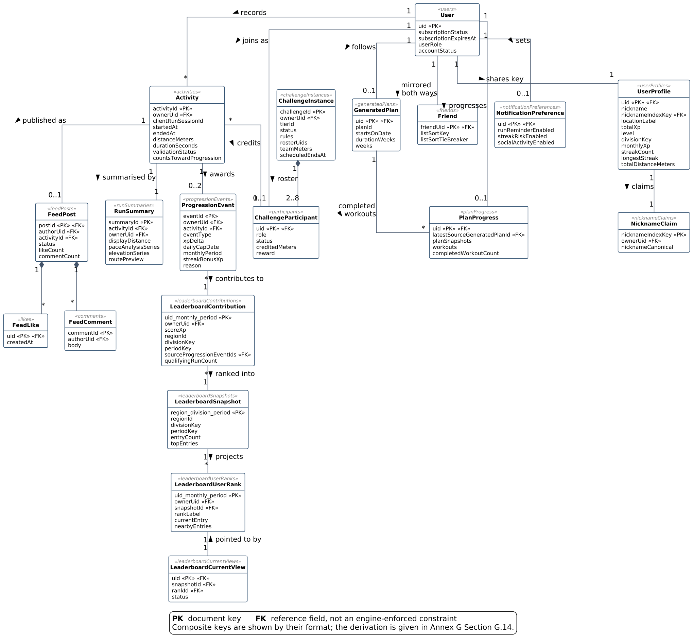

# Chapter 3: Database Design

## 3.1 Entity-relationship model

Figure 3.1 shows the nineteen principal entities and the reference paths between them. The complete database holds fifty-seven document paths; the model shows the entities that carry the running, progression, competition and social workflow, and the remainder carry configuration, moderation, error reporting, notification delivery and marketing.

*Figure 3.1: Entity-relationship model of the Runiac database*

The relationships the diagram shows are these.

| From | To | Cardinality | Reference field |
| --- | --- | --- | --- |
| User | UserProfile | 1 : 1 | shared document key |
| User | Activity | 1 : * | `ownerUid` |
| Activity | RunSummary | 1 : 1 | `activityId` |
| Activity | ProgressionEvent | 1 : 0..2 | `activityId` |
| User | GeneratedPlan | 1 : 0..1 | shared document key |
| User | PlanProgress | 1 : 0..1 | shared document key |
| GeneratedPlan | PlanProgress | 1 : * completed workouts | `planId` inside the `workouts` map |
| User | LeaderboardContribution | 1 : * (one per period) | `ownerUid` in the key |
| ProgressionEvent | LeaderboardContribution | * : 1 | `sourceProgressionEventIds` |
| LeaderboardContribution | LeaderboardSnapshot | * : 1 | `regionId` + `divisionKey` + `periodKey` |
| LeaderboardSnapshot | LeaderboardUserRank | 1 : * | `snapshotId` |
| User | ChallengeParticipant | 1 : 0..1 live | participant document key |
| ChallengeInstance | ChallengeParticipant | 1 : 2..8 | subcollection |
| Activity | ChallengeParticipant | * : 1 | credited through a contribution marker |
| Activity | FeedPost | 1 : 0..1 | shared document key |
| FeedPost | FeedLike, FeedComment | 1 : * | subcollections |
| User | Friend | 1 : * (mirrored both ways) | subcollection, `uid` |
| User | NotificationPreference | 1 : 0..1 | shared document key |

*Table 3.1: Relationships between the principal entities*

## 3.2 Entity descriptions

Each entity below is one Firestore collection. The description gives what the entity stores, what its document key is, who may write it, and the design decision it exists to carry. Field-level detail is held in the repository's schema documentation rather than reproduced here.

Throughout, a field described as **backend-owned** is one the server writes and the security rules refuse to accept from any client, in any collection. A field described as a **snapshot** is a value copied from another entity at write time and not read live.

### 3.2.1 Identity

**User** (`users/{uid}`). Stores account-level state for each Runiac account: subscription status and expiry, the operational role, and the account status used for suspension and deletion. The document key is the Firebase Authentication UID. It is readable by its owner and writable by no client at all, so the two fields that decide what a caller may do cannot be altered from a client. It is the document the security rules consult when they need to know whether a caller is Premium or suspended.

**UserProfile** (`userProfiles/{uid}`). Stores everything else about a runner: the onboarding answers they entered, their identity presentation, and their materialised progression totals. It shares its key with `User`, so the two are a one-to-one split of what a relational design would model as a single table. The split exists because the two halves have different threat models. The profile has to be client-writable, since a runner edits their own weight and availability, so it can only be defended field by field. The governance fields can be defended by having no client write path at all. A runner may write twelve fields here; the remaining thirty-odd are backend-owned. The `locationLabel` field is the one that reaches beyond this entity: it must end with a comma and the word Singapore, and it is matched against a table of planning areas to decide which leaderboard region the runner competes in.

**NicknameClaim** (`nicknameClaims/{nicknameIndexKey}`). Exists solely to manufacture uniqueness, which Firestore does not provide. Its key is `n1_` followed by the SHA-256 digest of the runner's canonical nickname (trimmed, Unicode-normalised and lower-cased), so two runners choosing nicknames that differ only in case, whitespace or composition compete for the same document key and only one can hold it. The document records the owning UID and both the canonical and display forms. It is denied to clients entirely, and the profile rule refuses a nickname change unless the matching claim will be held by the same caller once the write commits.

### 3.2.2 Activity recording

**Activity** (`activities/{activityId}`). The canonical record of a completed run: the runner, the four time measurements, distance and pace, the validation verdict, and the flags deciding whether the run counts toward progression, streak and the leaderboard. Its key is `activity_` followed by a digest of the runner's UID and the session identifier the client generated when the run started, so a retried submission targets the document the first attempt created rather than producing a second run. The document also stores a fingerprint of the submitted payload, which is what allows a replay carrying altered data to be told apart from an honest retry and rejected.

Every activity is written by the run-completion Cloud Function, already carrying a validated status. Validation happens before the write, so the database never holds a run whose trustworthiness is undetermined. The security rules do permit an owner to create an activity in a pending state, but no client path uses it.

**RunSummary** (`runSummaries/{summaryId}`). The presentation record for the same run: the measurements again, pre-formatted display strings, and the optional analysis series that drive the post-run charts (cadence, pace, elevation and a coarsened route preview). Its key derives from the same digest as its activity, so the pairing needs no lookup. The separation from `Activity` is a read-cost decision: the activity is read on every progression calculation, every streak evaluation and every feed publication and is queried across a runner's whole history, whereas the summary is opened only when the runner looks at one particular run. Keeping several hundred analysis samples out of the frequently-read document is what makes the history query cheap.

The route preview is stored at three decimal places of latitude and longitude, roughly a hundred-metre grid. That is a privacy measure as much as a size limit, since a saved route cannot be resolved to an individual address.

### 3.2.3 Progression

**ProgressionEvent** (`progressionEvents/{eventId}`). An immutable record of one experience award. This entity is what allows the project's fairness claim to be checked against a record, and it has no counterpart in the submitted design.

An event records the whole calculation behind an award: each component of the award separately, the raw total before the per-activity cap and again before the daily cap, whether each cap actually bound, the Singapore day and month the award was attributed to, the running totals for that day and month either side of this award, the streak state before and after, and the runner's experience, level, division and progress percentage before and after. A reason code distinguishes an award of zero from an award that never happened, so the application can tell a runner *why* a run earned nothing.

Two events may exist per activity, one for the run and one for a completed cool-down. Both keys derive from the activity's digest, which is what makes each award payable exactly once. Nothing in the system updates or deletes an event. The consequence is that the totals held on `UserProfile` are derived data rather than the record: the daily cap is enforced by summing the day's events rather than by trusting a counter, and a dispute about a runner's score is answered by reading the ledger.

### 3.2.4 Training plan

**GeneratedPlan** (`generatedPlans/{uid}`). The runner's current training plan, produced from their onboarding answers and stored as a nested structure of weeks, each containing up to seven workouts, each with its own detail block of metrics, effort guide and coaching notes. It is the largest client-writable document in the system, with twenty-one fields the runner owns, and the security rules validate the nested shape rather than only the top level, capping the plan at eight weeks and each week at seven workouts. A rest day is expressed by omitting the day from a week's workouts rather than by storing a rest entry.

**PlanProgress** (`planProgress/{uid}`). Records which scheduled workouts the runner has actually completed, keyed by plan and workout, together with what the run achieved and what the workout required. It is written only by the server, at the moment a submitted run is matched to a scheduled workout and found to have met its objective.

The entity carries one field that explains its size: `planSnapshots` holds a frozen copy of the plan as it stood at the time of each completion. Because the plan itself is owner-writable, a runner could otherwise edit a workout after completing it and invalidate their own record; matching later runs against the frozen snapshot rather than the live plan closes that.

### 3.2.5 Leaderboard

Four entities carry the leaderboard because Firestore cannot rank. A relational design would express a board as a query; here it has to be computed ahead of time by a scheduled job and stored, and the four entities are the accumulator and its three projections.

**LeaderboardContribution** (`leaderboardContributions/{uid}_monthly_{YYYY-MM}`). One accumulator per runner per month, whose key composes the runner and the period so that a second contribution for the same month is impossible. The score is accumulated with an atomic increment and the contributing event identifiers with an array union, so two runs finishing at the same moment cannot lose an award between them. The document also freezes the runner's region, division, alias and level label. Region is deliberately sticky once set for a period: a runner who changes their profile location mid-month keeps their score on the board they earned it on, and the new area takes effect from the next period.

**LeaderboardSnapshot** (`leaderboardSnapshots/monthly_{regionId}_{divisionKey}_{YYYY-MM}`). One board, holding the region and division labels, the total number of ranked runners, and the top ten entries fully rendered (alias, rank, score, level, division, region, avatar and progress). Nothing else has to be read to draw the board. With 37 Singapore planning areas and ten leagues, a period holds up to 370 of these. A rendered entry carries no owner UID, so a board discloses no identity beyond the alias its owner chose.

**LeaderboardUserRank** (`leaderboardUserRanks/{uid}_monthly_{YYYY-MM}`). One runner's own position: their rendered row plus a five-row window centred on them, so the "runners near you" view is also a single read.

**LeaderboardCurrentView** (`leaderboardCurrentViews/{uid}`). The pointer document the client opens first, naming which snapshot and which rank document to read. Its status field is what lets the application explain an empty leaderboard instead of showing nothing: a runner is ranked, unranked, missing a resolvable region, excluded by the premium policy, or short of the minimum qualifying runs.

### 3.2.6 Challenges

**ChallengeInstance** (`challengeInstances/{challengeId}`). A distance challenge that one runner owns and up to seven others join. It stores the tier, the mode, the state, the roster in join order, the credited team total, and the timing fields that bound the lobby and the challenge itself. It also stores an immutable snapshot of the tier's rules (target distance, duration, participant limits and the personal minimum), taken at creation, so a later change to the challenge catalogue cannot alter a challenge already under way.

**ChallengeParticipant** (`challengeInstances/{challengeId}/participants/{uid}`). One runner's membership of one challenge: role, state, credited distance and reward state, plus a frozen display name and initials. Its key is the runner's UID, so a runner appears at most once in a roster.

The participant record is deliberately narrow, and the narrowness is the design decision. It carries a distance total and nothing else about the runner's training: no route, no coordinates, no run timestamps, no activity history. The three values a roster screen also shows (level, avatar and progress) are resolved live from the profile per request rather than stored here, so they cannot go stale in a document another roster member can read.

Three supporting entities enforce invariants the database cannot: a reservation document keyed on the runner allows at most one live challenge at a time, a contribution marker keyed on the activity allows a run to be credited once, and a grant record keyed on the challenge and runner allows a reward to be issued once. Terminal outcomes are copied to a per-runner challenge history, and tier ownership to a per-runner badge record.

### 3.2.7 Social feed

**FeedPost** (`feedPosts/{postId}`). A published run. The key *is* the activity identifier, so a run can be published at most once and a post can never be orphaned from the run it describes. The document stores the run's headline measurements, the storage path and digest of its route thumbnail, the two engagement counters, and a snapshot of the author's name, initials and level label taken at publication.

Visibility is computed rather than stored. A post is readable when its status is published and the reader either is the author or holds a reciprocal friendship with them, with no block in either direction. All of this is checked inside the security rules on each read, so there is no visibility field to get out of step with the friend graph.

**FeedLike** (`feedPosts/{postId}/likes/{uid}`). Keyed on the liker, so the existence of the document *is* the like and a runner cannot like a post twice. The body holds only the liker's UID and a timestamp.

**FeedComment** (`feedPosts/{postId}/comments/{commentId}`). The comment body, bounded at 500 characters and required to be non-blank at both ends, together with the same three author snapshot fields. The comment rule is one of the few places where a rule reads another document live: the author identity written into a comment must match the caller's own profile, so a comment cannot be posted under a fabricated display name.

Both counters on the post are maintained by recounting the subcollection inside a transaction rather than by incrementing. Recounting is the more expensive choice and is deliberate: an increment that is lost or double-applied leaves a counter permanently wrong, whereas a recount corrects itself on the next write.

### 3.2.8 Friend graph

**Friend** (`users/{uid}/friends/{friendUid}`). A friendship is stored as two mirrored documents, one in each runner's subtree, and both must exist before the relationship is trusted. There is no shared edge record. Each document holds a snapshot of the other party's nickname, display name and initials, plus two sort fields: the other party's canonical nickname and their UID as a tie-breaker.

Those extra fields are the price of a document database. The duplicated UID exists because a collection-group query cannot filter on document key, and the nickname rename fan-out and the account-deletion sweep both need to find every mirror referring to one runner regardless of whose subtree it sits in. The two sort fields exist because a friend list has to be ordered by a display value the engine cannot compute, and the tie-breaker makes that ordering total and therefore stably paginable.

Two sibling collections use the same shape. A friend request is likewise two mirrored documents, one marked outgoing and one incoming, both carrying the same sender and recipient so that either is self-describing; requests are deleted on acceptance or decline rather than transitioned, so a pending state is the only one ever stored. A block is stored one-directionally but read symmetrically, so a block by either party suppresses visibility for both, and it deletes the friendship in both directions.

### 3.2.9 Notifications

**NotificationPreference** (`notificationPreferences/{uid}`). The runner's own choices about which reminders they receive (planned runs, rest days, streak warnings and social activity), together with a preferred reminder time and quiet hours. It is one of the few entities the runner writes directly, and every field on it is owner-writable.

Three further collections carry the delivery machinery rather than the runner's choices: device tokens keyed on the digest of the token rather than the token itself, delivery attempts keyed on the notification and the device so that a stuck send does not become a notification storm, and the in-application inbox keyed so that the same notification can never be delivered twice.

## 3.3 Summary

The Runiac database holds nineteen principal entities carrying the running, progression, competition and social workflow, within fifty-seven document paths in total. Because Firestore enforces no schema, every structural guarantee in the model is created deliberately: uniqueness by choosing document keys that an operation determines, referential intent by convention and by application-maintained reference fields, and integrity by a hundred reserved field names that no client write may contain.

The two design decisions that most shape the model both follow from that. The first is the split between what a runner owns and what the server owns, applied consistently enough that it separates `User` from `UserProfile` and puts a runner's rank beyond their reach entirely. The second is the progression event ledger, which turns a runner's experience total into derived data and makes every award answerable with a stored record of how it was calculated.

The repository holds the full schema reference alongside the security rules and the index definitions: the complete collection inventory, the backend-owned field list, the client-writable surface with its validation, the deterministic key formats and the Cloud Storage layout.
