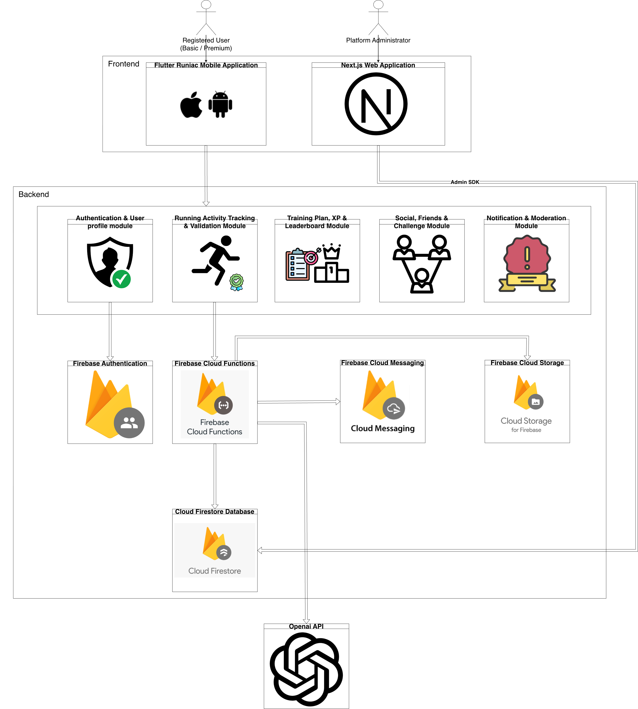
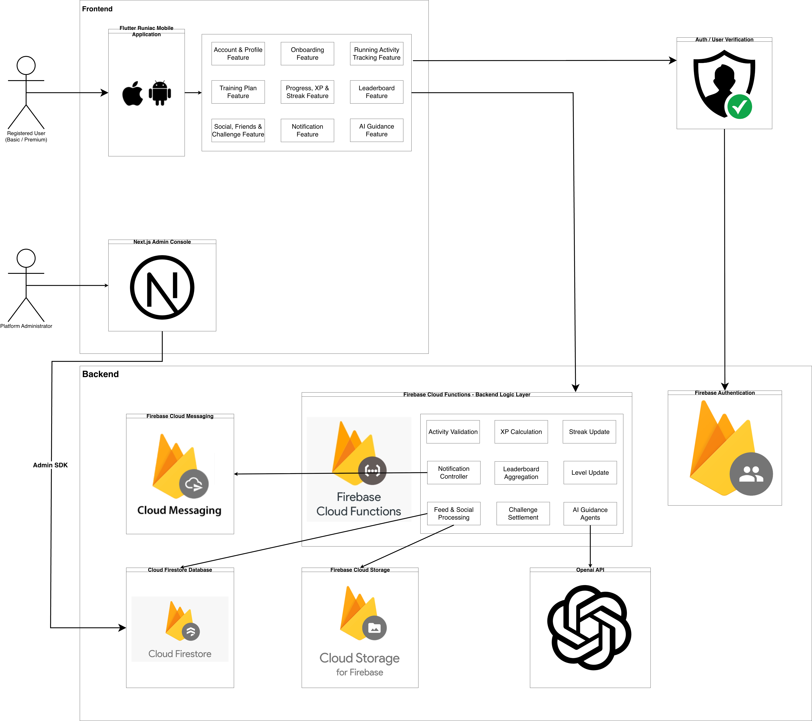

# Chapter 4: Architecture Design

## 4.1 Physical architecture

*Figure 4.1: Physical architecture of the delivered system*

The diagram shows where each part of Runiac runs and which channels connect it to the rest. It carries the principal components; a few supporting services named in this section are left out of it so that it stays readable.

### 4.1.1 The two client applications

**The Flutter application** runs on iOS and Android from one codebase of 641 Dart files across 19 feature modules, presenting roughly 85 screens. It is the only client a Registered User touches. An Unregistered User reaches it too, but only as far as the twelve-screen tour, sign-up, log-in and password reset.

Two characteristics of this client are unusual, and both shape Chapter 5. It uses **no state-management package**: nineteen `ChangeNotifier` stores are exposed through ten hand-written `InheritedNotifier` scopes. It also uses **no routing package**: there is a single `MaterialApp` and navigation is imperative. Both were deliberate: the dependency surface stays small and the data flow stays inspectable.

Beneath the Dart code sits a native layer of eight platform channels carrying work Flutter cannot do alone: the Android foreground service that keeps tracking alive when the screen is off, the iOS Live Activity, cadence estimated from the phone's motion sensors and the event stream it publishes on, haptics, notification permission prompts, device-local plan reminder scheduling, and sharing a card to an Instagram Story. Through this layer the application also reaches GPS, the text-to-speech engine used for voice coaching, and Mapbox for map tiles. Chapter 5 takes the layer apart.

**The Next.js web application** is the second client and serves two audiences from one codebase: seventeen public routes of the marketing site for anyone, and thirteen console sections for a Platform Administrator. It is Next.js 16 on the App Router with React 19 and Server Actions, rendered on a Node.js host rather than exported statically, because both halves need server-side credentials.

Authentication here differs deliberately from the mobile client's. A signing-in administrator obtains a Firebase ID token in the browser, and the server exchanges it for a **session cookie with a five-day expiry**; every later request is authorised by verifying that cookie server-side, so the browser never holds a long-lived credential.

The consequence is the asymmetry Figure 4.1 draws as two different arrows into the data. **The mobile client reaches Firestore through Cloud Functions; the console reaches it directly through the Firebase Admin SDK, which bypasses security rules entirely.** Administrative authority in Runiac is therefore *possession of the service-account credential*: `firestore.rules` grants an administrator nothing and never reads a custom claim. That is defensible for a single-operator system, but it does mean the console's own session check is the only thing standing between a signed-in browser and privileged data.

### 4.1.2 Backend modules

The backend is organised into five modules, each owning one area of behaviour together with the collections that area writes.

| Module | Responsibility |
| --- | --- |
| Authentication & User Profile | Identity, profile, nickname, avatar, subscription state, account deletion |
| Running Activity Tracking & Validation | Run submission, payload validation, the completion transaction, run summaries |
| Training Plan, XP & Leaderboard | Plan generation and progress, the experience formula, streak, level, monthly aggregation |
| Social, Friends & Challenge | Feed publication and engagement, the friend graph, distance challenges and their settlement |
| Notification & Moderation | Device registry, scheduled dispatch, the in-application inbox, reporting and administrative commands |

*Table 4.1: The five backend modules*

All five are implemented as Cloud Functions code, so the module boundary is one of responsibility rather than of deployment. Within the source they are further divided into seventeen domain folders, which Chapter 5 describes.

### 4.1.3 External service

One external service is reached, and only from the backend: the **OpenAI API**, used through LangChain with the `gpt-4o-mini` model, for the three guidance agents: the home guide, activity feedback and workout briefing. The API key is held as a Cloud Functions secret and never reaches the client, which is why each agent is a callable rather than a direct call from the device. Chapter 5 describes the validation envelope an agent's output must pass before a runner sees it.

Mapbox is external too, but it is reached from the device rather than the backend, and so belongs to the client rather than to this tier.

## 4.2 Application architecture

*Figure 4.2: Application architecture of the delivered system*

Where Figure 4.1 shows where code runs, Figure 4.2 shows how a request travels through it.

### 4.2.1 Feature layer

Nine feature areas make up what a runner sees, each owning its own screens, widgets and view models: account and profile, onboarding, running activity tracking, training plan, progress and experience, leaderboard, social with friends and challenges, notifications, and AI guidance. They map onto the ten functional requirements of Chapter 2, with the distance-challenge subsystem sitting inside the social area.

No feature talks to Firebase directly. Each depends on a repository interface declared in its own domain folder, with a Firebase implementation behind it. That seam is the subject of Chapter 5, and it is the reason an offline build and a demonstration build are both possible.

### 4.2.2 Backend logic layer

Nine responsibilities make up the trusted logic, and every one of them exists because its result must not be computable on the device.

**Activity Validation** checks a submitted run against twenty-four accepted fields, a reserved-name list, scalar bounds and a set of cross-field consistency checks before anything is stored. The submitted pace must agree with the submitted distance and duration, and a future timestamp is clamped to server time.

**XP Calculation**, **Streak Update** and **Level Update** apply the experience formula, the per-activity and per-day caps, the streak milestone rules and the level curve. They run inside the same transaction as validation, and each award writes an immutable audit record.

**Leaderboard Aggregation** turns per-runner contributions into ranked boards. Because Firestore cannot rank, this runs on a schedule under a fifteen-minute lease, deduplicating, grouping by region and division, sorting and writing pre-rendered projections.

**Challenge Settlement** drives the largest state machine in the system, with three-phase settlement so that a failure part-way through leaves work the next sweep can retry without paying a reward twice.

**Feed & Social Processing** publishes an activity to the feed, maintains engagement counts by recounting rather than incrementing, and owns the friend graph and nickname uniqueness.

**Notification Controller** plans and dispatches scheduled notifications and writes the in-application inbox, de-duplicating so that the same notification cannot be delivered twice.

**AI Guidance Agents** call the OpenAI API, validate what comes back against a safety envelope, and fall back to deterministic copy when generation fails.

These nine responsibilities are implemented across seventeen source modules, which Chapter 5 sets out one level down.

## 4.3 Relationship to the submitted design

The Project Design Document presented a physical architecture in its Section 2.1 and an application architecture in its Section 2.2. The diagrams above are revisions of those. This section records what changed.

| Aspect | Project Design Document | Delivered | Why |
| --- | --- | --- | --- |
| Deployable units | Two: Flutter client and Firebase backend | **Three**: the Next.js web tier is a separate unit with its own runtime and its own credential | The public site and the administrator console were built after the design was submitted |
| Backend decomposition | Three modules: authentication and profile; activity tracking and validation; plan, XP and leaderboard | **Five modules**, over seventeen source folders | The delivered scope is far wider than the three modules covered |
| Cloud Storage | Absent | Present, with six prefixes for avatars, thumbnails, share cards and project documents | No binary asset handling was designed |
| Cloud Messaging | In the application diagram only | In both, with a full device-registry, dispatch and inbox subsystem | Delivery de-duplication and inbox state were not anticipated |
| App Check, Cloud Scheduler, Trigger Email | Absent | Present | Attestation, cron and transactional mail were added during implementation |
| Native platform layer | Absent | Nine platform channels | The design treated the client as a single Flutter block |
| External services | None shown | OpenAI API for three guidance agents; Mapbox on the device | AI-assisted guidance was added as F10 |
| Region | Not stated | `asia-southeast1` for every function | Made explicit to match the single-market scope |
| Client internal structure | Not modelled | State scopes, repository interfaces and channel adapters, documented in Chapter 5 | The seam that makes offline and demonstration builds possible needed to be visible |
| Automation | Not modelled | Six scheduled functions and thirteen document triggers as their own lane | Most backend work is now not user-initiated |
| Medical Trainer / Expert lane | Present, with an expert plan submission path and an approval flow in the backend | **Removed entirely** | The role is not part of this project and does not exist in the implementation |
| Administration | Two generic nodes for administrative CRUD | Thirteen console sections and an explicit command pattern | Direct administrative writes were replaced by request documents so that every privileged action is recorded |
| Leaderboard | Weekly and monthly ranking | **Monthly only**, over 37 Singapore planning areas and ten leagues | Weekly ranking was not built; the drift register records this |

*Table 4.2: The submitted architecture diagrams mapped onto the delivered system*

Two of these need a sentence beyond the table.

The **third deployable unit** changes the trust model. The web tier reaches Firestore with Admin SDK credentials rather than through Cloud Functions, which is why Section 4.1.2 records administrative authority as possession of a credential rather than as a rule. A design that had anticipated the console would probably have routed it through callables as the mobile client does; the delivered arrangement is simpler and is adequate for a single-operator system, but it concentrates authority in one place and Chapter 9 discusses what tightening it would involve.

The **removal of the Medical Trainer / Expert lane** removes a backend node the design named (the expert plan approval flow), and with it the only path by which content authored outside the team would have entered the system. Every plan in the delivered system is generated from the runner's own onboarding answers.

## 4.4 Summary

Runiac is three deployable units over one Firebase project in a single Singapore region: a Flutter client of nineteen feature modules over a native layer of eight platform channels, a Firebase backend of sixty-four functions across five modules, and a Next.js web tier carrying both the public site and the administrator console.

The architecture is organised around a boundary. The client may read widely and write narrowly; everything that decides standing or entitlement is computed by code the runner cannot reach; and everything an administrator does with side effects passes through a request document so that the action, its outcome and its actor are all recorded. The layering in Figure 4.2 exists to make that boundary a single, visible line rather than a rule repeated in every module. Chapter 5 opens each of these components in turn.
