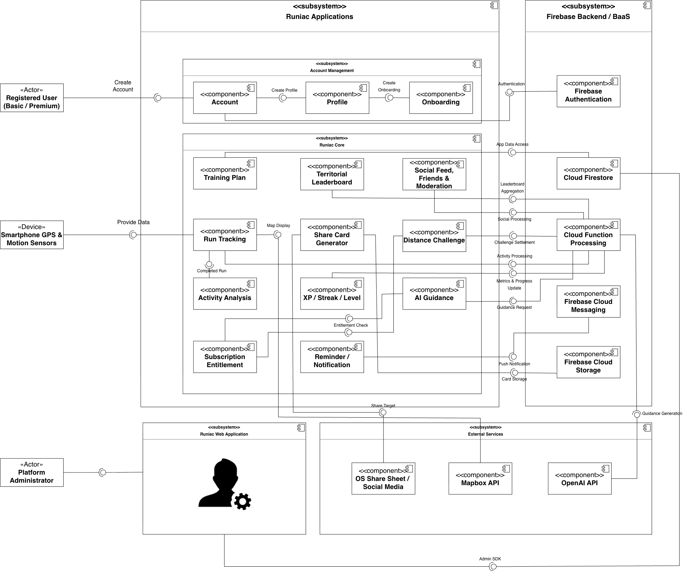

# Chapter 5: Component Design

## 5.1 Component diagram

*Figure 5.1: Component diagram of the delivered system*

## 5.2 Component descriptions

### 5.2.1 Account Management

**Account** owns registration, sign-in, password reset and sign-out. It is the only component that requires the `Authentication` interface from Firebase Authentication, so identity enters the system at one point. It also owns account deletion, which it performs by requesting it rather than by erasing anything itself.

**Profile** owns the runner's own data (name, date of birth, weight, location, nickname and avatar) and the display identity other runners see. Nickname and avatar are the two fields it cannot write directly: both go through the backend, because a nickname must be unique across the whole system and an avatar must be validated before it becomes visible.

**Onboarding** collects running experience, goals, availability, health and readiness answers across a one-question-per-page flow, and produces the profile from which the first training plan is generated. It is a distinct component rather than part of Profile because it runs once and has its own navigation model. Its output feeds plan generation rather than the profile screen.

### 5.2.2 Runiac Core

**Run Tracking** is the largest component in the client. It owns the run lifecycle (start, pause, resume, end, save), live GPS collection, the cool-down sequence and voice coaching. It requires `Map Display` from Mapbox for the live map and `Provide Data` from the phone's GPS and motion sensors, and on completion it requires `Activity Processing` from the backend. It computes no award of any kind; it submits a payload and receives a verdict.

**Activity Analysis** turns a completed run into a per-run summary, pace and cadence series, split detail and trend views. It requires `Completed Run` from Run Tracking and reads stored summaries for history. Its advanced tier is a Premium capability, so it requires `Entitlement Check`. It contains a complete heart-rate builder with a zone policy, which has no live data source in the delivered application because heart rate only ever arrived through the withdrawn import path. Chapter 2 Section 2.6.2 records this.

**Training Plan** owns the generated weekly plan, the weekly schedule, workout detail and schedule editing. It is one of the few components that writes directly to Cloud Firestore, through `App Data Access`, because a generated plan is the runner's own document rather than a competitive value. The backend, rather than this component, decides whether a scheduled workout counts as completed.

**XP / Streak / Level** presents experience, level, streak, division and progress. It writes nothing. It requires `Metrics & Progress Update` from the backend, which is the only source of these values. It exists as a separate component chiefly so that the fairness property has a visible home in the design.

**Territorial Leaderboard** presents regional and league-based rankings, the runner's own position and the runners near them. It requires `Leaderboard Aggregation`, and like the previous component it reads pre-computed results rather than ranking anything itself.

**Social Feed, Friends & Moderation** owns the feed timeline, publishing a run, likes and comments, friend search, requests and blocking, and reporting content or a user. These are grouped as one component because they share a single trust question (who may see whom), which the security rules answer once for all of them.

**Distance Challenge** owns the challenge catalogue, lobby creation, invitations, live progress, results, badges and history. It requires `Challenge Settlement` from the backend. Its premium tiers are gated too, but through a separate mechanism: a list of premium-only tiers in its own configuration document, checked against subscription state when a lobby is created, rather than through the feature-key catalogue.

**AI Guidance** owns the three assisted surfaces: the home guide, activity feedback and the workout briefing. It also owns the consent flow that precedes them. It requires `Guidance Request` from the backend and never contacts a model provider itself.

**Reminder / Notification** owns notification preferences, the in-application inbox and the device-local scheduling of plan reminders. It requires `Push Notification` from Firebase Cloud Messaging.

**Share Card Generator** renders an achievement or rank card, requires `Card Storage` from Cloud Storage to hold it and `Share Target` from the operating system's share sheet to send it. It requires `Entitlement Check` as well, against the `shareCards` key. The administrator has published that key at the basic tier, so the gate currently admits everyone.

**Subscription Entitlement** is a small component with a wide reach. It resolves whether a runner may use a given capability, from a seven-key catalogue the administrator publishes, and it provides the `Entitlement Check` interface that Activity Analysis, AI Guidance, Share Card Generator and the feed-publication path within Social Feed require. The catalogue deliberately excludes run tracking, progression, the leaderboard, friends and challenges: those are the surfaces where a gate would touch competitive standing rather than convenience.

### 5.2.3 Runiac Web Application

One Next.js application serving two audiences. The **public website** carries the marketing pages, pricing, project documents and the newsletter sign-up. The **administrator console** carries thirteen operational sections. Both require `Admin SDK` access to Cloud Firestore, which is what makes the web tier a component boundary worth drawing separately rather than folding into the client: it is the only part of the system that reaches the database without passing a security rule.

### 5.2.4 Firebase Backend / BaaS

**Cloud Function Processing** provides most of the interfaces the client requires. It is the trusted compute surface described in Chapter 4, and it is drawn here as a single component because that is what it is from the client's point of view: one boundary with many operations.

**Cloud Firestore** provides `App Data Access` to the client and `Trusted Data Access` to the functions, and enforces its own security rules on the first of those. **Firebase Authentication** provides identity. **Firebase Cloud Messaging** provides push delivery. **Cloud Storage** provides object storage for avatars, feed thumbnails, share cards and project documents.

### 5.2.5 External Services

**Mapbox API** provides map tiles and styles for the live run map. **OS Share Sheet / Social Media** provides the share target for a generated card. **OpenAI API** provides `Guidance Generation` to Cloud Function Processing rather than to the client.

## 5.3 Summary

Runiac is built from twenty-four components across four subsystems. Eleven make up the running experience in the mobile client and three more carry account and identity; two form the web application; five are managed Firebase services and three are external.

The component boundaries encode the same commitment the rest of the report describes. Every component that *displays* a competitive value (experience, level, streak, division, rank) requires an interface to obtain it and has no means of producing it. Every component that *decides* one runs on the server. The interface names on the diagram mark where that line falls, and they are the reason the fairness properties of Chapter 2 and the trust boundary of Chapter 3 are structural.

Beneath the components sit two structures the earlier documents did not model: a repository seam in the client that lets the same code run against a live backend, an emulator or compiled sample data, and a native platform layer of eight channels carrying the work Flutter cannot do alone. Chapter 6 turns to what all of this presents to a runner.
