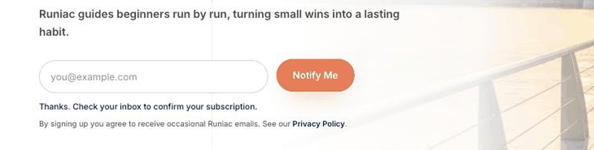

# Chapter 6: User Interface Design

## 6.1 Unregistered User: public website

The website has to do two things for a visitor who has never heard of the product: explain what it is, and be honest about what it costs.

*Figure 6.1: Website landing page*

The landing page leads with the habit rather than the sport ("keep your running habit going"), because the target user is not looking for a training tool. The primary action is the download, and it appears before any feature list.

*Figure 6.2: Pricing page*

Pricing is a full page rather than a modal, with both tiers side by side and the yearly saving stated in cash terms as well as a percentage. The free tier is described by what it includes rather than by what it lacks, which is the same decision the in-application paywall makes in Section 6.4.

*Figure 6.3: Project documents page*

The documents page is unusual for a consumer product and exists because this is a university project: it publishes the project's own documentation, uploaded through the administrator console described in Section 6.5.

*Figure 6.4: Newsletter sign-up on the home page, showing the confirmation message*

The only thing a visitor can submit without an account is an email address. The field sits in the home page hero beside a **Notify Me** button, directly under the headline, so it is the first action on the site that does not require installing anything. It asks for the address and nothing else, and the line beneath states what the visitor is agreeing to and links to the Privacy Policy. Pressing the button clears the field and returns the message shown above.

*Figure 6.5: Subscription confirmed after the emailed link is opened*

Nothing is added to the list at that point. Runiac uses double opt-in: a confirmation email is sent, and only when its single link is opened does the address become a subscriber and reach the screen above. An address that never confirms receives nothing. This is a compliance requirement rather than a design flourish, and Chapter 8 Section 8.6 treats the resulting list as the project's delivered lead-capture mechanism. The administrator's view of the same list is in Section 6.5.

## 6.2 Unregistered User: entering the application

*Figure 6.6: Application welcome screen*

The welcome screen offers two routes: create an account, or log in. Nothing else is reachable from here. Earlier project documents described a third route, a tour a visitor could take before registering, and manual test script 1.3.4 established that no such entry point exists on this screen or on the sign-up screen. Chapter 2 Section 2.2 records the correction.

*Figure 6.7: Account creation*

Registration asks for the minimum: an email address and a password, or Google Sign-In. Everything else is collected during onboarding, where it can be explained.

*Figure 6.8: Password reset*

### 6.2.1 Onboarding

Sixteen screens collect the profile from which the first training plan is generated. Four are shown here; the User Manual documents all sixteen.

*Figure 6.9: Onboarding, first screen*

The sequence opens by explaining why it is asking, and by naming how long it will take. The running buddy appears here for the first time.

*Figure 6.10: Onboarding, current running frequency*

Answers are large tap targets rather than a slider or a text field. There is no free-text entry anywhere in onboarding, which is what allows every answer to be validated against a fixed set and stored without sanitisation concerns.

*Figure 6.11: Onboarding, health and readiness*

The health questions are the reason onboarding is one question per page. They ask about symptoms and comfort, and the wording is deliberately unclinical. Their answers set a safety band that constrains how quickly the generated plan progresses, and Chapter 2 Section 2.6.3 describes what that band does.

*Figure 6.12: Onboarding, generated plan preview*

The last screen shows the plan the answers produced, before the runner is asked to accept it. The sequence ends with a result rather than a confirmation button, so that the sixteen questions visibly produce something.

*Figure 6.13: Application tour, first step*

The twelve-step tour starts by itself the first time a runner reaches the dashboard after finishing onboarding, and can be replayed afterwards from the menu. It is a coach-mark overlay on the real interface rather than a separate slideshow, so what the runner is shown is what they will actually see. Because it arms on completing sign-up, it belongs to a registered user's first session rather than to a visitor's evaluation of the product, which is the sequence shown here.

## 6.3 Registered User (Basic)

Everything in this section is available to every registered user. Premium adds to it rather than replacing it.

### 6.3.1 Home

*Figure 6.14: Home stage map*

The week is an illustrated path of stepping stones, one per day, with the running buddy standing on today. This is the screen that most distinguishes Runiac from the competitors surveyed in Chapter 1, all of which open on a metrics dashboard. The design intent is that opening the application on a rest day should feel like part of the plan rather than like a missed target.

*Figure 6.15: Home menu*

The menu carries everything the five-tab bar does not: profile and level, current streak, notifications, friends, challenges, settings and the tour.

### 6.3.2 Recording a run

*Figure 6.16: Pre-run screen*

The map centres on the runner's location and the sheet shows today's planned session with a single primary action. The pill at the top reports GPS status before the run starts, because a beginner who starts a run on a poor fix and loses it has no way to interpret what happened.

*Figure 6.17: Voice coaching settings*

Spoken updates are configured before the first run: language, distance and time intervals, and what each announcement contains. Voice coaching matters disproportionately for this audience because it is the only guidance available while the phone is in a pocket.

*Figure 6.18: Live run tracking*

During a run the screen shows distance, elapsed time and current pace above a following map, with pause as the only action. Everything else is deliberately absent. The distance reads zero in this capture because the iOS simulator's synthetic location fixes never populate a speed, so the tracking session classifies every sample as stationary and no distance accrues. Chapter 7 Section 7.9 sets out the consequence for testing.

*Figure 6.19: Paused run*

Pausing changes the primary action to resume and offers finish as the secondary, so that the destructive choice is never the easy one.

### 6.3.3 Progress and plan

*Figure 6.20: Progress*

Weekly distance, consistency streak and a running calendar. The streak is stated in days and given a supportive line rather than a warning, which is the same decision the notification copy makes.

*Figure 6.21: Training plan detail*

A generated plan is presented week by week with each session named and described. Rest days are shown as part of the plan rather than as gaps.

*Figure 6.22: Editing the schedule*

The runner can move a session to a different day or time. The plan is theirs to adjust. Whether a completed session counts is decided by the backend.

### 6.3.4 Leaderboard

*Figure 6.23: Leaderboard region selection*

Rankings are by Singapore planning area, chosen on a map. The regional framing is what makes a leaderboard usable for a beginner, because competing against everyone is discouraging.

*Figure 6.24: Full ranking*

Within a region, runners are further divided into ten leagues by level, so a new runner is ranked against others at a similar stage. Chapter 3 Section 3.2.5 describes the projections that make this a single read.

### 6.3.5 Social

*Figure 6.25: Activity feed*

The feed shows runs published by the runner and by people they are mutually connected with. There is no public timeline and no discovery feed, which is a deliberate limit: a beginner's early runs are slow, and a design that exposed them to strangers would work against the product's purpose.

*Figure 6.26: Friends*

Friends are found by nickname search, added by mutual request, and can be blocked. The four tabs (friends, search, requests, blocked) put the whole relationship model on one screen.

*Figure 6.27: Distance challenge lobby*

A challenge is a shared distance target with a roster of up to eight. The lobby shows who has accepted before the challenge starts. The commitment is social rather than competitive, since the group succeeds or fails together.

### 6.3.6 Profile and settings

*Figure 6.28: Profile management*

This capture is from the current build and is worth comparing against an earlier one. The MANAGE list previously carried a **Watch & Health Apps** row, which opened the Apple Health import screen. The row and its screen were removed before submission when the import path was withdrawn, so the row is absent here. Chapter 2 Section 2.6.1 explains the withdrawal.

*Figure 6.29: Privacy and safety settings*

Privacy settings include hiding the runner's statistics from public profiles. Account deletion is recorded as a command document and carried out by the backend across thirty-eight erase steps, with a resume cursor so that an interrupted erase continues rather than restarting.

*Figure 6.30: Account deletion*

Account deletion is offered in the interface rather than buried in a support process. The screen states what will be erased before it asks for anything, and the confirmation requires the word DELETE to be typed rather than a button to be tapped twice. The friction is deliberate, because the operation is irreversible and removes the progression record along with everything else.

### 6.3.7 What a Basic user sees where Premium begins

*Figure 6.31: Subscription sheet*

The paywall sheet lists what Premium adds, shows both prices and highlights the yearly saving. Its content is read from a configuration document the administrator edits rather than being hard-coded, which is why Section 6.5 shows a console screen for editing it.

A locked feature remains reachable. Selecting a Premium challenge tier, a Premium character or the workout briefing opens this sheet with the relevant capability named. The one thing the sheet does not do is claim a purchase can be completed: no payment provider is integrated and the call to action says as much, which Chapter 8 records as the largest gap in the commercial model.

## 6.4 Registered User (Premium)

Premium adds guidance, analysis and presentation. It adds nothing that affects standing: there is no extra experience and no leaderboard advantage. Chapter 2 Section 2.4 establishes this as a product commitment rather than a configuration choice.

*Figure 6.32: Post-run coaching summary*

*Figure 6.33: Advanced run analysis*

Advanced analysis opens with a run-quality score and a plain-language reading of it. Pace analysis follows, covering average, fastest and slowest pace and a stability percentage, and then pace over distance and a cadence series.

One line on this screen reads: *"Missing wearable data does not lower this overview."* The analysis was designed to degrade honestly when a data source is absent rather than to penalise the runner or fabricate a figure. That turned out to matter more than expected: the wearable import path was never delivered, so the heart-rate section it would have populated is unreachable for every activity a runner can record. Chapter 2 Section 2.6.2 sets out why.

*Figure 6.34: AI activity feedback*

The three assisted surfaces (the home guide, activity feedback and the workout briefing) are presented as short card sequences rather than as a chat interface. That was a safety decision as much as a design one: a fixed number of cards with a fixed shape can be validated against a safety envelope before display, which an open conversation could not be.

*Figure 6.35: Challenge tiers on a Premium account*

The same screen a Basic user sees in Section 6.3.5, with the higher-distance tiers unlocked. Comparing the two is the clearest illustration of the "show it, do not hide it" rule.

## 6.5 Platform Administrator

The console is a web application, separate from the mobile client and reached from the public website's sign-in page. Authority comes from the `userRole` field rather than from a subscription, and an account without it is returned to the public site. One operator uses it, so the design priority is that every action is reversible or recorded rather than that it is fast.

Thirteen pages are delivered, listed in the sidebar in the order below. All thirteen are shown here, because Chapter 2 Section 2.3 lists them as delivered capability and a reader should be able to check that claim against the interface.

*Figure 6.36: Console overview*

The landing page answers one question: is anything waiting. Unresolved reports, pending exception cases, critical application errors and failed backend jobs are counted at the top, with registered users by tier, runs recorded, an active-user trend and a system health panel below.

*Figure 6.37: Exception queue*

Reported posts, users, routes and plans arrive in one queue alongside experience anomalies raised by the backend, filtered by type, severity and status. The administrator does not delete anything directly. Acting on a case writes a command document that a backend trigger carries out, which is why every moderation action leaves a record.

*Figure 6.38: Users and roles*

The user directory is searchable, and each row carries role, subscription, level, account state and join date. Expanding a row opens the operations panel, from which a role can be changed, an account suspended, a subscription set, a moderation action issued or an avatar cleared. Every one of those actions requires a typed reason and is written to the audit log, and recent administrator actions are listed at the foot of the same page so that the operator sees their own history without leaving the screen.

*Figure 6.39: Experience and gamification rules*

The award formula, the caps, the cool-down band, the level curve and the streak rewards are edited here rather than deployed. This screen is the visible face of the principle that policy is held as data rather than compiled into the backend, which Chapter 4 describes. It publishes rules and never edits a user's experience: a change applies from that user's next completed activity onward, and experience already awarded is not recomputed. Chapter 7 Section 7.9.1 records a case where a change made on this page altered award behaviour in production with no application release in between.

*Figure 6.40: Leaderboard oversight*

The aggregation job is monitored rather than driven from here. The page reports the current period, coverage and eligibility, and offers a recalculation request. Scoring stays in the backend and the console has no control that edits a rank or a score, which is what keeps the fairness requirement in Chapter 2 Section 2.7.8 true of the operator as well as of the users.

*Figure 6.41: Paywall configuration*

The title, badge, feature list, prices and call to action of the subscription sheet in Figure 6.31 are edited here. This page publishes display copy only. It cannot grant Premium to anyone, which is why entitlement is a separate concern handled on the automation and policy page.

*Figure 6.42: Website content*

The marketing site is edited by destination page, with tabs for Home, Pricing, FAQ, Documents, Download, About and site-wide elements. A section is expanded, edited and saved, so the pages in Section 6.1 are content rather than code.

*Figure 6.43: Project documents*

The PDFs listed on the public documents page are uploaded here with a title, a category and a document date. This page exists because the product is a university project, and it is what puts this report on the public site.

*Figure 6.44: Feedback and complaints*

In-application feedback arrives as an inbox grouped by an automatically assigned category. Automation summarises and removes duplicates first, so the administrator reviews what has been escalated rather than every submission.

*Figure 6.45: Newsletter*

Two tabs cover the subscriber list built by the sign-up in Figure 6.4 and the campaigns sent to it. A campaign is composed, tested and queued from here; the send itself runs as a backend job rather than in the browser.

*Figure 6.46: Application errors*

Errors from the Flutter client and from Cloud Functions are grouped by signature and carry a severity and a status. Reports are sanitised on the server before they arrive: no route, no precise location, no credential and no profile detail reaches this screen, which is the same privacy constraint Chapter 3 applies to the stored error documents.

*Figure 6.47: Automation and policy settings*

Four configurations are held here. Feature access sets the minimum tier for each gated capability, challenge tier access and character access do the same for challenge distances and guide characters, and moderation automation sets the auto-hide and escalation thresholds. Chapter 2 Section 2.4 reads the first of these as published.

*Figure 6.48: Governance and audit log*

Every administrative action and system event appears here with its actor, target and before-and-after values, including entries attributed to the system where a backend job produced them. Administrative authority in this project is possession of a credential, and the audit log is the control that makes that authority accountable.

Several of these pages are shown in an empty state. The console was captured against a seeded emulator database, which populates users, reports, activities and the audit log but not feedback, project documents, newsletter subscribers or a completed leaderboard period. On a live database each of those pages lists real records.
